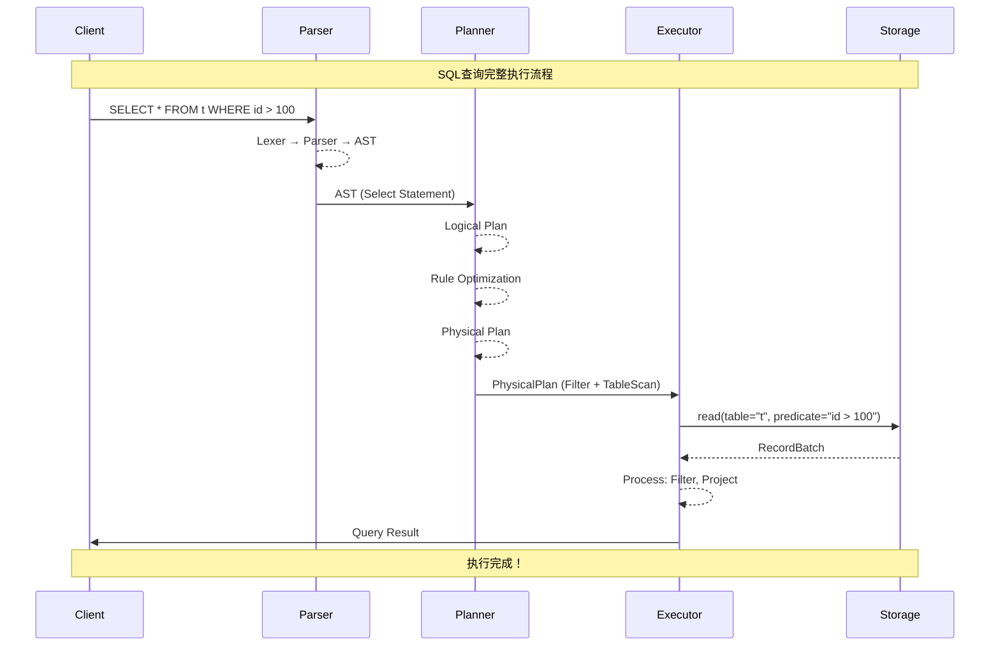
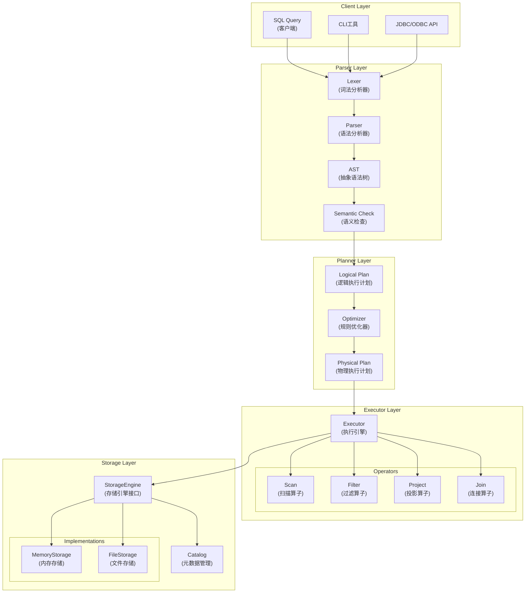
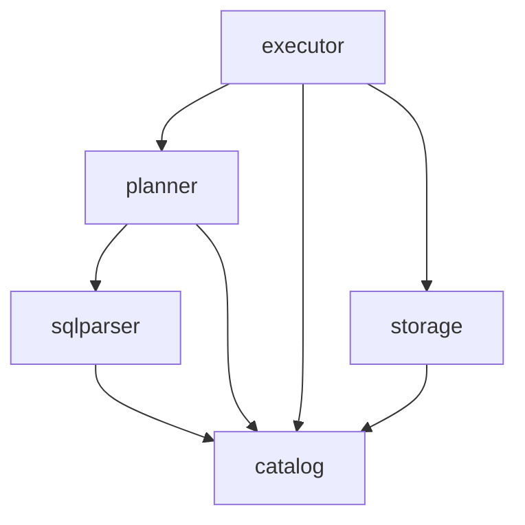

# SQLRustGo 1.0 架构设计文档

## 1. 架构概述

SQLRustGo 1.0采用分层架构设计，旨在实现一个最小可行的数据库系统，跑通核心执行流程。本架构遵循"高内聚、低耦合"的设计原则，确保系统具有良好的可维护性和可扩展性。

```
┌─────────────────────────────────────────────────────────────────────────────┐
│                        SQLRustGo 1.0 架构概览                                │
├─────────────────────────────────────────────────────────────────────────────┤
│                                                                             │
│  ┌─────────────────────────────────────────────────────────────────────┐   │
│  │                        Client Interface                             │   │
│  └─────────────────────────────────────────────────────────────────────┘   │
│                                    ↓                                       │
│  ┌─────────────────────────────────────────────────────────────────────┐   │
│  │                        Parser Layer                                 │   │
│  │   Lexer → Parser → AST → Semantic Check                            │   │
│  └─────────────────────────────────────────────────────────────────────┘   │
│                                    ↓                                       │
│  ┌─────────────────────────────────────────────────────────────────────┐   │
│  │                        Planner Layer                                │   │
│  │   Logical Plan → Optimizer → Physical Plan                          │   │
│  └─────────────────────────────────────────────────────────────────────┘   │
│                                    ↓                                       │
│  ┌─────────────────────────────────────────────────────────────────────┐   │
│  │                        Executor Layer                               │   │
│  │   Volcano Model → Operators → Pipeline                              │   │
│  └─────────────────────────────────────────────────────────────────────┘   │
│                                    ↓                                       │
│  ┌─────────────────────────────────────────────────────────────────────┐   │
│  │                        Storage Layer                                │   │
│  │   Catalog → MemoryStorage → FileStorage                             │   │
│  └─────────────────────────────────────────────────────────────────────┘   │
│                                                                             │
└─────────────────────────────────────────────────────────────────────────────┘
```

---

## 2. 核心组件

### 2.1 Parser Layer - 解析层

**功能**：SQL字符串解析、语法检查、语义验证

**核心组件**：

| 组件 | 职责 | 输入 | 输出 |
|------|------|------|------|
| **Lexer** | 词法分析，将SQL字符串转换为Token流 | SQL字符串 | `Vec<Token>` |
| **Parser** | 语法分析，将Token流转换为抽象语法树 | `Vec<Token>` | AST (`Statement`) |
| **Semantic Check** | 语义检查，验证表名、列名、类型等有效性 | AST | 验证后的AST |

**关键接口定义**：
```rust
pub enum Token {
    Keyword(String),
    Identifier(String),
    Literal(Literal),
    Operator(String),
    // ...
}

pub enum Statement {
    Select(SelectStmt),
    Insert(InsertStmt),
    Update(UpdateStmt),
    Delete(DeleteStmt),
    CreateTable(CreateTableStmt),
    // ...
}

pub trait Parser {
    fn parse(sql: &str) -> Result<Statement, ParseError>;
}
```

---

### 2.2 Planner Layer - 规划层

**功能**：查询规划与优化

**核心组件**：

| 组件 | 职责 | 输入 | 输出 |
|------|------|------|------|
| **Logical Planner** | 将AST转换为逻辑执行计划 | AST | LogicalPlan |
| **Optimizer** | 规则优化（谓词下推、投影剪裁等） | LogicalPlan | 优化后的LogicalPlan |
| **Physical Planner** | 将逻辑计划转换为物理执行计划 | LogicalPlan | PhysicalPlan |

**关键接口定义**：
```rust
pub enum LogicalPlan {
    Scan(Scan),
    Projection(Projection),
    Selection(Selection),
    Join(Join),
    // ...
}

pub enum PhysicalPlan {
    TableScan(TableScan),
    Filter(Filter),
    Project(Project),
    HashJoin(HashJoin),
    // ...
}

pub trait Planner {
    fn plan(&self, ast: &Statement) -> Result<PhysicalPlan, PlanError>;
}
```

---

### 2.3 Executor Layer - 执行层

**功能**：采用火山模型（Volcano Model）执行查询

**核心组件**：

| 组件 | 职责 | 输入 | 输出 |
|------|------|------|------|
| **Executor** | 执行引擎，驱动算子执行 | PhysicalPlan | 执行结果 |
| **Operators** | 执行算子（Scan、Filter、Project等） | 上游算子输出 | 算子处理结果 |
| **Pipeline** | 执行流水线，协调算子间的数据流动 | 算子DAG | 最终查询结果 |

**关键接口定义**：
```rust
pub trait Operator {
    fn next(&mut self) -> Result<Option<RecordBatch>, ExecError>;
}

pub struct Executor {
    storage: Arc<dyn StorageEngine>,
}

impl Executor {
    pub fn execute(&mut self, plan: PhysicalPlan) -> Result<Vec<RecordBatch>, ExecError> {
        // 构建执行算子树
        // 火山模型迭代执行
    }
}
```

---

### 2.4 Storage Layer - 存储层

**功能**：数据持久化与元数据管理

**核心组件**：

| 组件 | 职责 | 输入 | 输出 |
|------|------|------|------|
| **StorageEngine** | 存储引擎接口，定义数据读写契约 | 读写请求 | 数据/操作结果 |
| **MemoryStorage** | 内存存储引擎，适合开发测试 | 读写请求 | 内存中数据 |
| **FileStorage** | 文件存储引擎，持久化数据 | 读写请求 | 文件中数据 |
| **Catalog** | 元数据管理（表结构、列信息等） | 元数据请求 | Schema信息 |

**关键接口定义**：
```rust
pub trait StorageEngine {
    fn read(&self, table: &str, predicate: Option<Predicate>) -> Result<RecordBatch, StorageError>;
    fn write(&mut self, table: &str, batch: RecordBatch) -> Result<usize, StorageError>;
    fn delete(&mut self, table: &str, predicate: Predicate) -> Result<usize, StorageError>;
}

pub struct Catalog {
    tables: HashMap<String, TableSchema>,
}

pub struct TableSchema {
    name: String,
    columns: Vec<ColumnSchema>,
}
```

---

## 3. 执行流程

### 3.1 完整数据流



### 3.2 步骤详解

1. **SQL解析**：
   - Lexer将SQL字符串分解为Token流
   - Parser根据语法规则构建AST
   - Semantic Check验证语义正确性

2. **查询规划**：
   - Logical Planner将AST转换为关系代数表达式（逻辑计划）
   - Optimizer应用规则优化：谓词下推、投影剪裁、常量折叠
   - Physical Planner生成可执行的物理执行计划

3. **查询执行**：
   - Executor构建算子执行树
   - 采用火山模型，通过`next()`方法逐层驱动
   - 算子流水线执行，生成最终查询结果

4. **数据访问**：
   - StorageEngine提供统一的读写接口
   - 根据配置选择MemoryStorage或FileStorage
   - Catalog提供元数据服务

---

## 4. 架构图

### 4.1 整体架构图



### 4.2 模块依赖图



---

## 5. 设计约束与权衡

### 5.1 技术约束

| 约束类型 | 具体内容 | 影响 |
|---------|---------|------|
| **语言约束** | Rust所有权系统、借用检查 | 确保内存安全，但增加了学习曲线 |
| **并发约束** | Rust的Send/Sync trait约束 | 确保线程安全，无数据竞争 |
| **性能约束** | 内存使用高效，执行速度快 | Rust零成本抽象保障性能 |
| **兼容性约束** | 兼容MySQL协议子集 | 便于现有工具接入 |

### 5.2 功能约束

| 版本 | 功能范围 | 说明 |
|------|---------|------|
| **1.0-alpha** | Parser + Executor + MemoryStorage | 跑通核心执行流程 |
| **1.0-beta** | 基本DML支持（SELECT/INSERT） | 验证完整数据流 |
| **1.0** | 基础事务、文件存储 | 最小可用版本 |

### 5.3 关键权衡决策

#### 决策1：存储引擎选择

| 选项 | 优点 | 缺点 | 最终选择 |
|------|------|------|---------|
| **内存存储** | 实现简单，速度极快 | 数据不持久 | 1.0版本优先实现 |
| **文件存储** | 数据持久化 | 实现复杂 | 1.0后期版本支持 |
| **第三方KV存储** | 复用现有实现 | 引入外部依赖 | 2.0版本考虑 |

**决策理由**：1.0版本目标是"跑通最小闭环"，内存存储可以快速验证核心流程，文件存储在后续迭代中添加。

---

#### 决策2：执行模型选择

| 选项 | 优点 | 缺点 | 最终选择 |
|------|------|------|---------|
| **火山模型** | 简单易实现，模块化好 | 虚函数调用开销 | ✅ 1.0版本采用 |
| **向量化执行** | 性能更好，CPU缓存友好 | 实现复杂度高 | 1.2版本引入 |
| **编译执行** | 极致性能 | 开发周期长 | 2.0版本远景 |

**决策理由**：火山模型是数据库执行器的经典实现，模块化好，易于理解和调试，适合1.0版本建立基础架构。

---

#### 决策3：优化器策略

| 选项 | 优点 | 缺点 | 最终选择 |
|------|------|------|---------|
| **规则优化** | 简单直观，易调试 | 优化能力有限 | ✅ 1.0版本采用 |
| **成本优化** | 优化更智能 | 需要统计信息 | 1.3版本引入 |
| **Cascades框架** | 高度可扩展 | 实现极其复杂 | 远景目标 |

**决策理由**：规则优化器可以快速实现，能够满足1.0版本的基础优化需求。

---

## 6. 扩展点设计

### 6.1 存储引擎扩展

```rust
┌─────────────────────────────────────────────────────┐
│          StorageEngine Trait (扩展点)                 │
├─────────────────────────────────────────────────────┤
│  + read(table, predicate)                            │
│  + write(table, batch)                               │
│  + delete(table, predicate)                          │
└─────────────────────────────────────────────────────┘
                          ▲
                          │
        ┌─────────────────┼─────────────────┐
        │                 │                 │
┌──────────────┐  ┌──────────────┐  ┌──────────────┐
│ MemoryStorage│  │ FileStorage  │  │  ColumnStore │
└──────────────┘  └──────────────┘  └──────────────┘
     (v1.0)          (v1.0)           (v1.5)
```

### 6.2 执行算子扩展

```rust
┌─────────────────────────────────────────────────────┐
│            Operator Trait (扩展点)                    │
├─────────────────────────────────────────────────────┤
│  + next() -> Option<RecordBatch>                     │
└─────────────────────────────────────────────────────┘
                          ▲
                          │
    ┌─────────────────────┼─────────────────────┐
    │                     │                     │
┌────────┐           ┌────────┐           ┌────────┐
│ Filter │           │ Project│           │ HashJoin│
└────────┘           └────────┘           └────────┘
   (v1.0)              (v1.0)              (v1.1)
```

---

## 7. 代码结构组织

```
sqlrustgo-1/
├── Cargo.toml
├── src/
│   ├── main.rs
│   ├── lib.rs
│   ├── parser/
│   │   ├── mod.rs
│   │   ├── lexer.rs      # 词法分析器
│   │   ├── token.rs      # Token定义
│   │   ├── parser.rs     # 语法分析器
│   │   └── ast.rs        # 抽象语法树定义
│   ├── planner/
│   │   ├── mod.rs
│   │   ├── logical.rs    # 逻辑执行计划
│   │   ├── optimizer.rs  # 规则优化器
│   │   └── physical.rs   # 物理执行计划
│   ├── executor/
│   │   ├── mod.rs
│   │   ├── executor.rs   # 执行引擎
│   │   └── operators.rs  # 执行算子
│   ├── storage/
│   │   ├── mod.rs
│   │   ├── engine.rs     # 存储引擎接口
│   │   ├── memory.rs     # 内存存储实现
│   │   ├── file.rs       # 文件存储实现
│   │   └── catalog.rs    # 元数据管理
│   └── types/
│       ├── mod.rs
│       ├── value.rs      # 数据类型定义
│       └── schema.rs     # Schema定义
└── docs/
    └── design/
        └── architecture_v1.0.md  # 本文档
```

---

## 8. 测试策略

| 测试层级 | 测试范围 | 测试工具 | 覆盖率目标 |
|---------|---------|---------|-----------|
| **单元测试** | 每个模块的独立功能 | Rust内置测试框架 | > 80% |
| **集成测试** | 模块间协作（Parser→Planner→Executor） | Rust内置测试框架 | > 70% |
| **端到端测试** | 完整SQL执行流程 | sqllogictest | 覆盖所有SQL语法 |
| **性能测试** | 查询执行性能 | criterion.rs | 持续监控回归 |

---

## 9. 版本演进路线图

| 版本 | 时间 | 核心里程碑 |
|------|------|-----------|
| **v1.0-alpha** | 2026-Q1 | Parser + Executor + MemoryStorage，跑通SELECT |
| **v1.0-beta** | 2026-Q1 | INSERT/UPDATE/DELETE支持，基础事务 |
| **v1.0** | 2026-Q2 | FileStorage持久化，稳定API |
| **v1.1** | 2026-Q2 | JOIN支持，优化器增强 |
| **v1.2** | 2026-Q3 | 向量化执行，统计信息 |
| **v1.3** | 2026-Q3 | Cascades优化器，性能基准测试 |
| **v2.0** | 2026-Q4 | 分布式执行引擎 |

---

## 10. 设计原则回顾

✅ **单一职责**：每层只负责一个核心功能（解析/规划/执行/存储）

✅ **依赖倒置**：高层依赖抽象（StorageEngine trait），不依赖具体实现

✅ **开闭原则**：通过trait定义扩展点，对扩展开放，对修改关闭

✅ **接口隔离**：每个trait定义最小必要接口

✅ **依赖方向**：Parser → Planner → Executor → Storage，单向无循环
