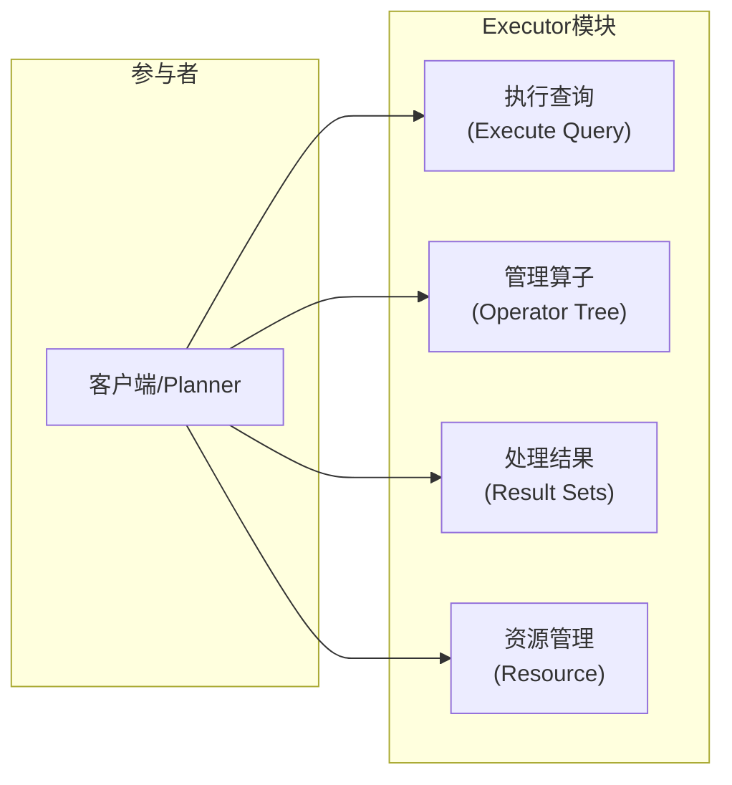
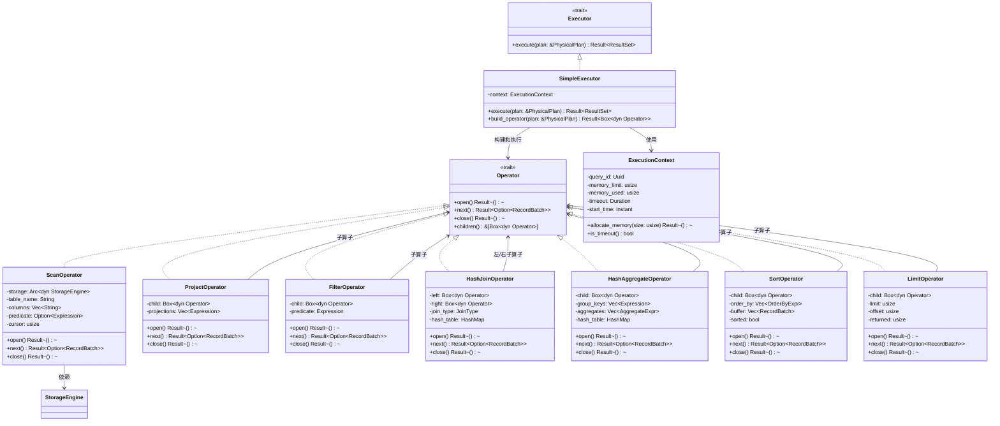
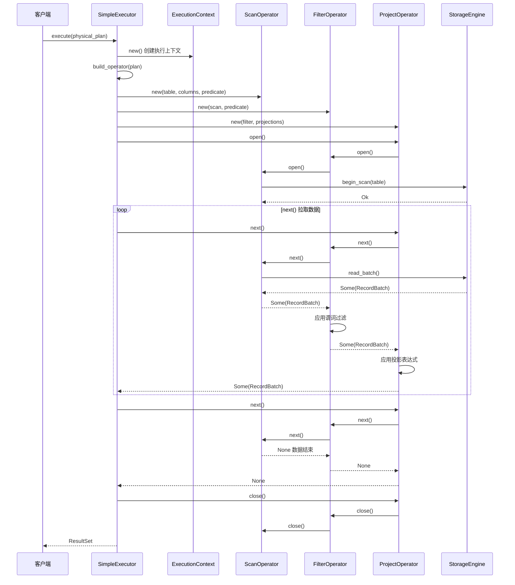
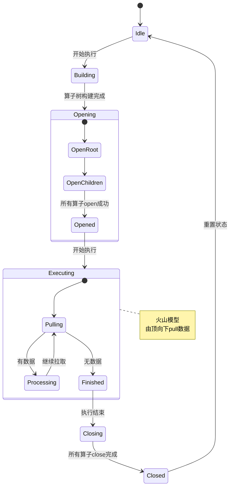

# Executor 模块设计文档

## 1. 模块概述

### 1.1 模块职责

Executor模块基于火山模型(Volcano Model)实现查询执行引擎，负责物理执行计划的实际执行。通过算子树的方式，逐个处理数据。

### 1.2 核心功能

| 功能 | 说明 |
|------|------|
| **执行查询** | 根据物理执行计划执行查询 |
| **管理算子** | 创建和管理执行算子树 |
| **处理结果** | 处理和返回执行结果 |
| **资源管理** | 管理执行过程中的内存和资源 |

### 1.3 设计原则

- **火山模型**：采用标准的Volcano执行模型
- **向量化执行**：支持批量数据处理提高性能
- **算子复用**：算子设计独立可复用
- **错误隔离**：执行错误不影响其他查询

---

## 2. OOA分析

### 2.1 用例图



### 2.2 概念类图

```mermaid
classDiagram
    class "执行引擎" as Executor {
        +execute(plan) ResultSet
        +cancel(query_id)
    }
    
    class "执行算子" as Operator {
        <<interface>>
        +open()
        +next() Option~RecordBatch~
        +close()
    }
    
    class "执行计划" as PhysicalPlan {
        +OperatorType type
        +List~PhysicalPlan~ children
    }
    
    class "结果集" as ResultSet {
        +Schema schema
        +List~RecordBatch~ batches
        +row_count() usize
    }
    
    class "执行上下文" as ExecutionContext {
        +QueryId query_id
        +u64 memory_used
        +HashMap config
    }
    
    Executor "1" --> "1" PhysicalPlan : 接收
    Executor "1" --> "*" Operator : 构建
    Executor "1" --> "1" ExecutionContext : 使用
    Operator "*" --> "1" ResultSet : 产生
```

### 2.3 活动图

```mermaid
stateDiagram-v2
    [*] --> 接收物理执行计划
    
    接收物理执行计划 --> 构建执行算子树
    构建执行算子树 --> 初始化执行上下文
    
    初始化执行上下文 --> 调用算子open()
    调用算子open() --> 循环调用算子next()
    
    循环调用算子next() --> 有数据?:
    有数据? --> 处理记录批次 : 是
    处理记录批次 --> 收集执行结果
    收集执行结果 --> 循环调用算子next()
    
    有数据? --> 调用算子close() : 否
    调用算子close() --> 清理执行资源
    清理执行资源 --> 返回结果集
    
    返回结果集 --> [*]
```

---

## 3. OOD设计

### 3.1 设计类图



### 3.2 顺序图



### 3.3 状态图



### 3.4 组件图

```mermaid
graph TD
    subgraph Executor组件
        Engine["执行引擎<br/>(Executor)"]
        subgraph Operators
            Scan["Scan算子"]
            Filter["Filter算子"]
            Project["Project算子"]
            Join["Join算子"]
            Agg["Aggregate算子"]
        end
        Context["执行上下文<br/>(Context)"]
    end
    
    subgraph Storage组件
        Engine["存储引擎"]
    end
    
    subgraph Common组件
        Batch["RecordBatch"]
        Expr["表达式计算"]
    end
    
    Engine --> Scan
    Engine --> Filter
    Engine --> Project
    Engine --> Join
    Engine --> Agg
    Engine --> Context
    
    Scan --> Engine : 依赖
    Operators --> Batch : 产出
    Operators --> Expr : 使用
```

---

## 4. 核心接口设计

### 4.1 Operator Trait（火山模型核心）

```rust
pub trait Operator: Send + Sync {
    fn open(&mut self) -> Result<(), ExecError>;
    
    fn next(&mut self) -> Result<Option<RecordBatch>, ExecError>;
    
    fn close(&mut self) -> Result<(), ExecError>;
    
    fn children(&self) -> &[Box<dyn Operator>] {
        &[]
    }
    
    fn name(&self) -> &str;
}
```

### 4.2 Executor Trait

```rust
pub trait Executor {
    fn execute(&mut self, plan: &PhysicalPlan) -> Result<ResultSet, ExecError>;
    
    fn execute_stream(&mut self, plan: &PhysicalPlan) 
        -> Box<dyn Iterator<Item = Result<RecordBatch, ExecError>>>;
}
```

### 4.3 ExecutionContext

```rust
pub struct ExecutionContext {
    query_id: Uuid,
    memory_limit: usize,
    memory_used: usize,
    batch_size: usize,
    start_time: Instant,
    timeout: Option<Duration>,
}

impl ExecutionContext {
    pub fn allocate_memory(&mut self, size: usize) -> Result<(), ExecError> {
        if self.memory_used + size > self.memory_limit {
            return Err(ExecError::MemoryLimitExceeded);
        }
        self.memory_used += size;
        Ok(())
    }
    
    pub fn is_timeout(&self) -> bool {
        self.timeout.map_or(false, |t| self.start_time.elapsed() > t)
    }
}
```

---

## 5. 算子设计

### 5.1 核心算子列表

| 算子 | 说明 | 实现复杂度 |
|------|------|-----------|
| **Scan** | 表扫描算子 | 低 |
| **IndexScan** | 索引扫描算子 | 中 |
| **Filter** | 过滤算子 | 低 |
| **Project** | 投影算子 | 低 |
| **HashJoin** | Hash连接算子 | 高 |
| **NestedLoopJoin** | 嵌套循环连接算子 | 中 |
| **HashAggregate** | Hash聚合算子 | 高 |
| **Sort** | 排序算子 | 中 |
| **Limit** | 分页算子 | 低 |

### 5.2 向量化执行

```rust
// 每次处理1024行的批次，而不是单行
pub const DEFAULT_BATCH_SIZE: usize = 1024;

// RecordBatch包含多行数据，支持SIMD优化
pub struct RecordBatch {
    schema: Schema,
    columns: Vec<ColumnArray>,
    row_count: usize,
}
```

---

## 6. 错误处理设计

### 6.1 错误类型

```rust
#[derive(Debug)]
pub enum ExecError {
    OperatorError(String),
    StorageError(StorageError),
    ExpressionError(ExprError),
    MemoryLimitExceeded,
    QueryTimeout,
    Canceled,
    InternalError(String),
}
```

### 6.2 错误恢复策略

1. **原子关闭**：确保所有算子正确关闭释放资源
2. **错误隔离**：单个查询错误不影响其他查询
3. **详细日志**：记录完整的错误栈和上下文信息

---

## 7. 测试策略

| 测试类型 | 测试内容 |
|---------|---------|
| **算子单元测试** | 每个算子的open/next/close |
| **集成测试** | 完整算子树执行 |
| **TPC-H测试** | 标准基准测试验证正确性 |
| **内存测试** | 验证内存使用不超过限制 |
| **并发测试** | 多查询并发执行 |
| **性能测试** | 单个算子和整体执行性能 |
