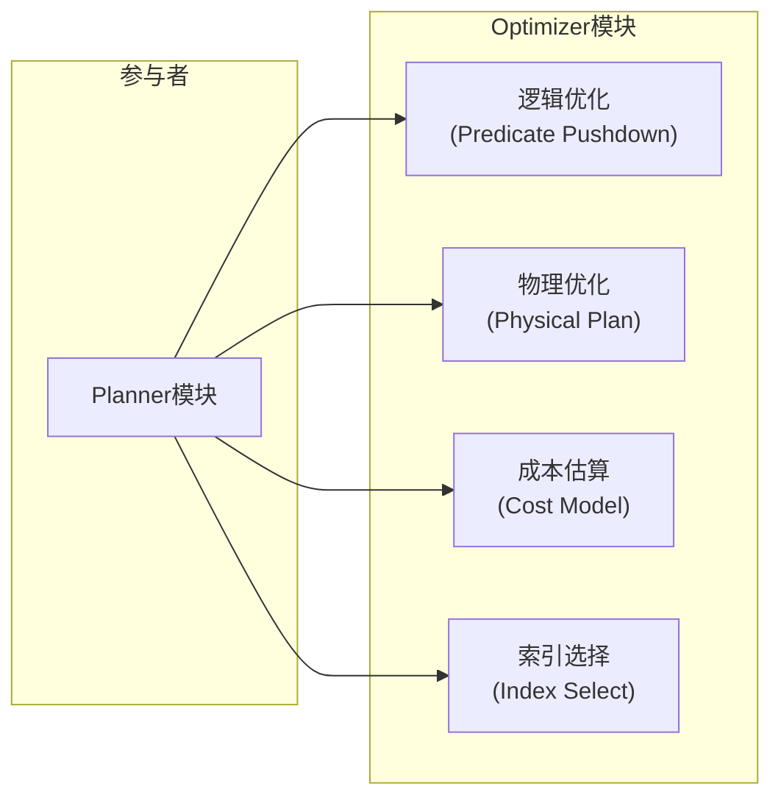
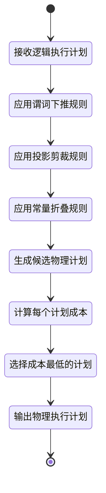
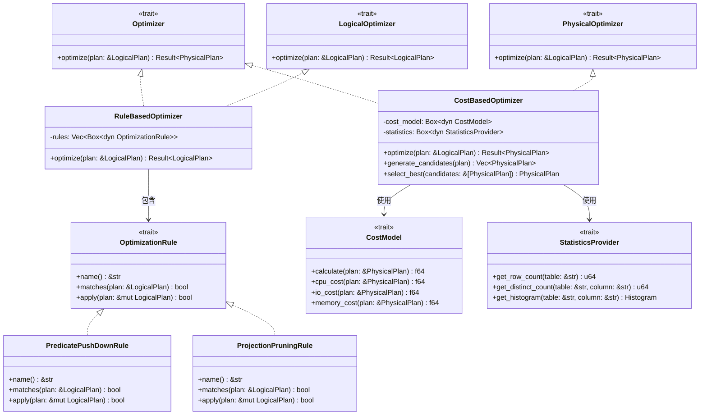
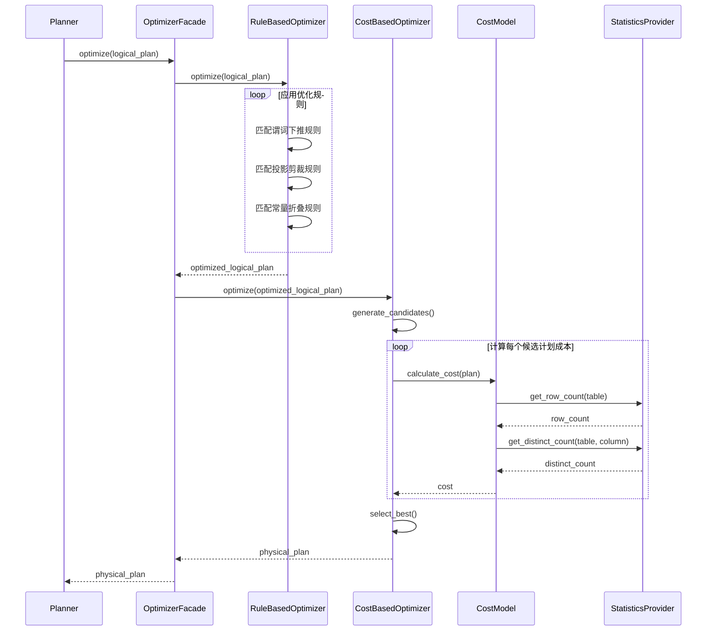
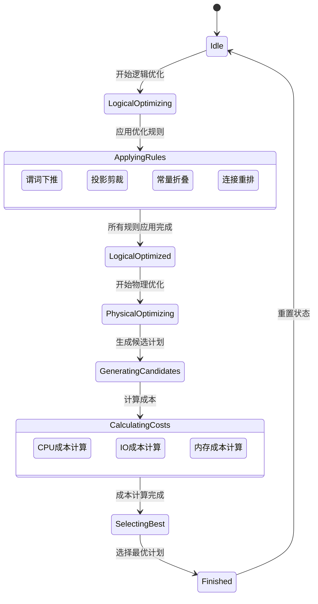

# Optimizer 模块设计文档

## 1. 模块概述

### 1.1 模块职责

Optimizer模块负责将逻辑执行计划转换为高效的物理执行计划，通过应用各种优化规则和成本估算，选择最优的执行策略。

### 1.2 核心功能

| 功能 | 说明 |
|------|------|
| **逻辑优化** | 应用代数优化规则（谓词下推、投影剪裁等） |
| **物理优化** | 生成候选物理执行计划 |
| **成本估算** | 计算每个物理计划的执行成本 |
| **计划选择** | 选择成本最低的物理执行计划 |

### 1.3 设计原则

- **基于规则+基于成本**：结合规则优化和成本优化
- **可扩展性**：便于添加新的优化规则和成本模型
- **可插拔**：支持替换不同的优化策略

---

## 2. OOA分析

### 2.1 用例图



### 2.2 概念类图

```mermaid
classDiagram
    class "逻辑执行计划" as LogicalPlan {
        +PlanType type
        +List~Expression~ projections
        +Expression predicate
    }
    
    class "物理执行计划" as PhysicalPlan {
        +OperatorType op_type
        +Cost cost
        +List~PhysicalPlan~ children
    }
    
    class "优化规则" as Rule {
        +String name
        +match(plan) bool
        +apply(plan) LogicalPlan
    }
    
    class "成本模型" as CostModel {
        +estimate_cost(plan) f64
        +get_row_count(plan) u64
    }
    
    class "统计信息" as Statistics {
        +TableStats table_stats
        +ColumnStats column_stats
        +Histogram histogram
    }
    
    LogicalPlan "1" --> "*" Rule : 应用
    LogicalPlan "1" --> "1" PhysicalPlan : 转换
    PhysicalPlan "1" --> "1" CostModel : 使用
    CostModel "1" --> "1" Statistics : 依赖
```

### 2.3 活动图



---

## 3. OOD设计

### 3.1 设计类图



### 3.2 顺序图



### 3.3 状态图



### 3.4 组件图

```mermaid
graph TD
    subgraph Optimizer组件
        RO["规则优化器<br/>(Rule-Based)"]
        CO["成本优化器<br/>(Cost-Based)"]
        Rules["优化规则库<br/>(Rule Library)"]
        CM["成本模型<br/>(Cost Model)"]
    end
    
    subgraph Planner组件
        LP["逻辑执行计划"]
        PP["物理执行计划"]
    end
    
    subgraph Common组件
        Stats["统计信息"]
        Expr["表达式处理"]
    end
    
    RO --> Rules : 使用
    CO --> CM : 使用
    CO --> Stats : 依赖
    
    LP --> RO : 输入
    RO --> CO : 输出
    CO --> PP : 输出
    
    Optimizer --> Expr : 依赖
```

---

## 4. 核心接口设计

### 4.1 Optimizer Trait

```rust
pub trait Optimizer {
    fn optimize(&mut self, plan: &LogicalPlan) -> Result<PhysicalPlan, OptimizeError>;
}
```

### 4.2 OptimizationRule Trait

```rust
pub trait OptimizationRule {
    fn name(&self) -> &str;
    fn matches(&self, plan: &LogicalPlan) -> bool;
    fn apply(&self, plan: &mut LogicalPlan) -> bool;
}
```

### 4.3 CostModel Trait

```rust
pub trait CostModel {
    fn calculate_cost(&self, plan: &PhysicalPlan) -> f64;
    fn cpu_cost(&self, plan: &PhysicalPlan) -> f64;
    fn io_cost(&self, plan: &PhysicalPlan) -> f64;
    fn memory_cost(&self, plan: &PhysicalPlan) -> f64;
}
```

### 4.4 LogicalPlan 定义

```rust
#[derive(Debug, Clone)]
pub enum LogicalPlan {
    Scan(Scan),
    Projection(Projection),
    Selection(Selection),
    Join(Join),
    Aggregate(Aggregate),
    Sort(Sort),
    Limit(Limit),
}
```

### 4.5 PhysicalPlan 定义

```rust
#[derive(Debug, Clone)]
pub enum PhysicalPlan {
    TableScan(TableScan),
    IndexScan(IndexScan),
    Filter(Filter),
    Project(Project),
    HashJoin(HashJoin),
    NestedLoopJoin(NestedLoopJoin),
    HashAggregate(HashAggregate),
    Sort(Sort),
}
```

---

## 5. 优化规则设计

### 5.1 内置优化规则

| 规则名称 | 说明 | 优先级 |
|---------|------|--------|
| **谓词下推** | 将过滤条件尽可能下推到数据源 | 最高 |
| **投影剪裁** | 只读取需要的列 | 高 |
| **常量折叠** | 预计算常量表达式 | 中 |
| **连接重排** | 重新排列连接顺序 | 中 |
| **子查询展开** | 将子查询转换为连接 | 低 |

### 5.2 规则应用策略

1. **迭代应用**：循环应用规则直到稳定
2. **启发式排序**：按优先级排序规则应用顺序
3. **最大迭代次数**：防止无限循环

---

## 6. 成本模型设计

### 6.1 成本公式

```
总成本 = CPU成本 + IO成本 + 内存成本

CPU成本 = (行数 × 每行处理开销) × CPU权重
IO成本 = (页面数 × 每页读取开销) × IO权重
内存成本 = (内存使用量) × 内存权重
```

### 6.2 成本参数

| 参数 | 默认值 | 说明 |
|------|--------|------|
| CPU权重 | 1.0 | CPU时间成本 |
| IO权重 | 10.0 | IO操作成本 |
| 内存权重 | 0.1 | 内存使用成本 |
| CPU每行开销 | 0.001 | 处理一行的CPU开销 |
| IO每页开销 | 1.0 | 读取一页的IO开销 |

---

## 7. 测试策略

| 测试类型 | 测试内容 |
|---------|---------|
| **规则单元测试** | 每个优化规则的正确性 |
| **成本模型测试** | 成本计算的准确性 |
| **集成测试** | 完整优化流程 |
| **TPC-H测试** | 标准基准测试集验证优化效果 |
| **性能测试** | 优化器本身的执行性能 |
