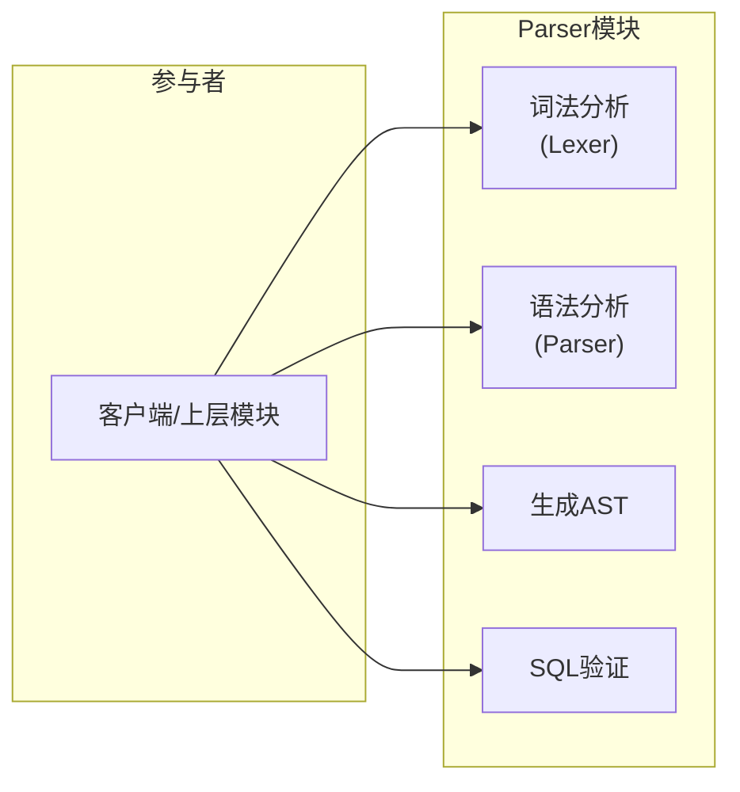
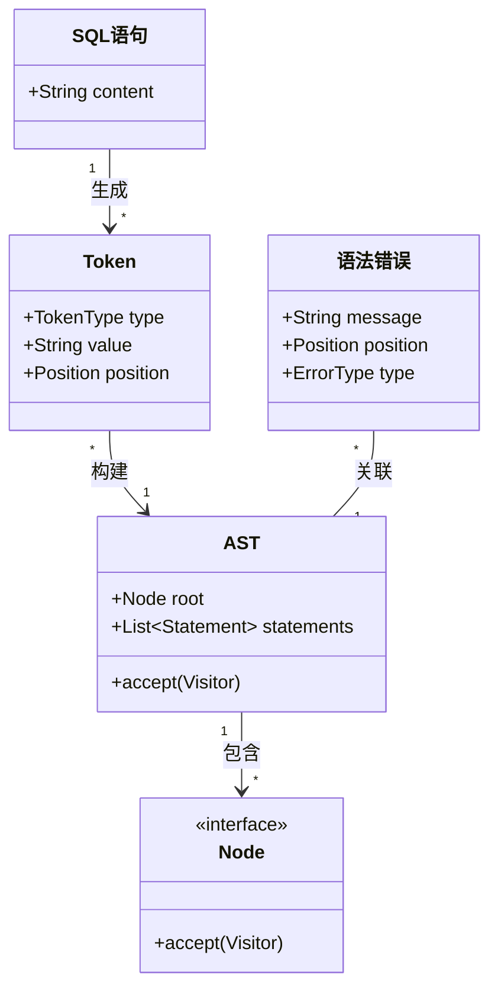
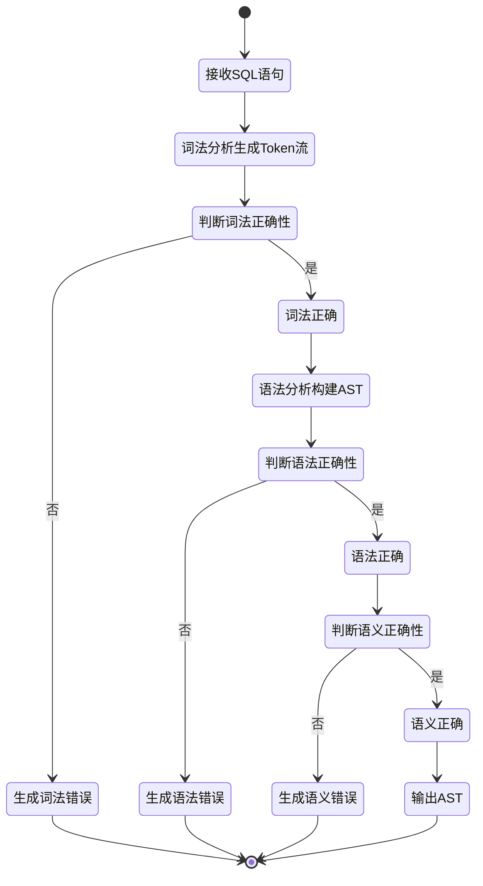
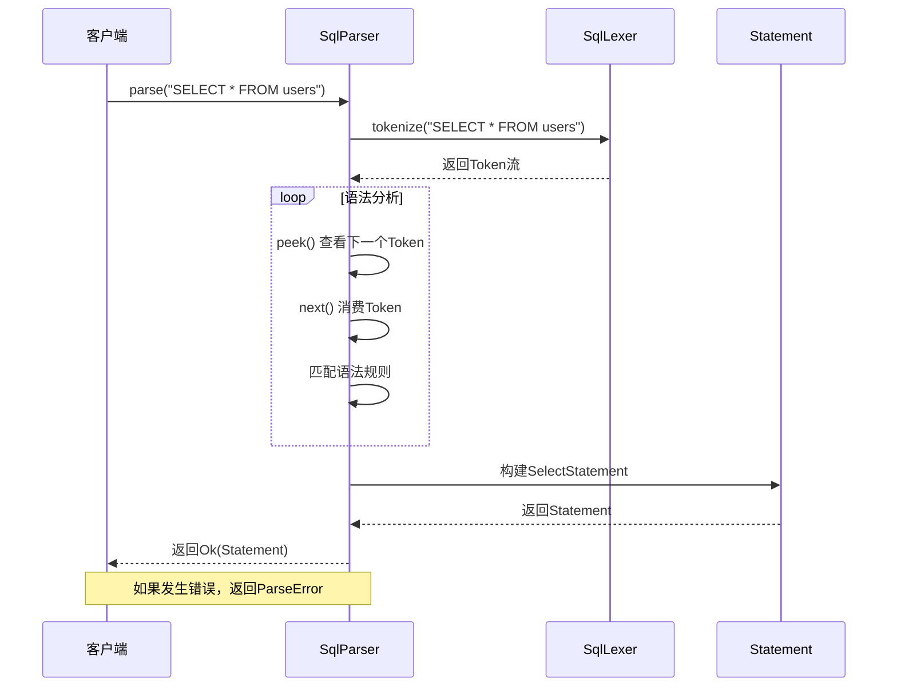
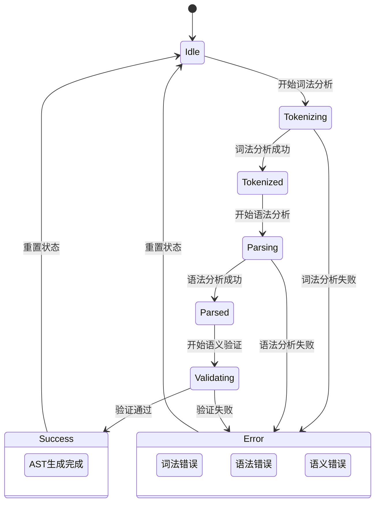

# Parser 模块设计文档

## 1. 模块概述

### 1.1 模块职责

Parser模块是SQLRustGo数据库系统的入口，负责将SQL字符串转换为抽象语法树（AST），为后续的查询规划和执行提供基础。

### 1.2 核心功能

| 功能 | 说明 |
|------|------|
| **词法分析** | 将SQL字符串分解为Token流 |
| **语法分析** | 根据SQL语法规则构建抽象语法树 |
| **语义检查** | 验证SQL语句的语义正确性 |
| **错误处理** | 提供详细的语法和语义错误信息 |

### 1.3 设计原则

- **单一职责原则**：Lexer只做词法分析，Parser只做语法分析
- **开闭原则**：便于扩展支持更多SQL语法
- **错误友好**：提供准确的错误位置和信息

---

## 2. OOA分析

### 2.1 用例图



**参与者与用例说明**：

| 参与者 | 用例 | 说明 |
|--------|------|------|
| 客户端/上层模块 | 词法分析 | 将SQL字符串转换为Token流 |
| 客户端/上层模块 | 语法分析 | 将Token流转换为AST |
| 客户端/上层模块 | 生成AST | 构建抽象语法树 |
| 客户端/上层模块 | SQL验证 | 验证SQL语句正确性 |

### 2.2 概念类图



### 2.3 活动图



---

## 3. OOD设计

### 3.1 设计类图

```mermaid
classDiagram
    class Lexer {
        <<trait>>
        +tokenize(sql: &str) Result~Vec~Token~~
    }
    
    class Parser {
        <<trait>>
        +parse(tokens: &[Token]) Result~Statement~
        +validate(ast: &Statement) Result~()~
    }
    
    class SqlLexer {
        -keywords: HashSet<String>
        -operators: HashSet<String>
        +tokenize(sql: &str) Result~Vec~Token~~
    }
    
    class SqlParser {
        -tokens: Vec~Token~
        -position: usize
        +parse(sql: &str) Result~Statement~
        +peek() Option~Token~
        +next() Option~Token~
        +expect(expected: &Token) Result~()~
    }
    
    class Token {
        +token_type: TokenType
        +value: String
        +position: Position
        +Display() String
    }
    
    enum TokenType {
        Keyword
        Identifier
        Literal
        Operator
        LParen
        RParen
        Comma
        Asterisk
        Eof
    }
    
    class Statement {
        <<enum>>
        Select(SelectStatement)
        Insert(InsertStatement)
        Update(UpdateStatement)
        Delete(DeleteStatement)
        CreateTable(CreateTableStatement)
    }
    
    class Expression {
        <<enum>>
        Column(String)
        Literal(Value)
        Binary(Expression, Op, Expression)
        Unary(Op, Expression)
    }
    
    class ParseError {
        +ParseErrorType type
        +String message
        +Position position
        +Display() String
    }
    
    Lexer <|.. SqlLexer : 实现
    Parser <|.. SqlParser : 实现
    
    SqlParser --> Token : 使用
    SqlParser --> Statement : 生成
    SqlParser --> ParseError : 产生
    
    Statement "*" --> "*" Expression : 包含
    
    Token *-- TokenType : 包含
```

### 3.2 顺序图



### 3.3 状态图



### 3.4 组件图

```mermaid
graph TD
    subgraph Parser组件
        Parser["Parser<br/>(语法分析)"]
        Lexer["Lexer<br/>(词法分析)"]
        AST["AST<br/>(语法树)"]
        Errors["Errors<br/>(错误处理)"]
    end
    
    subgraph Types组件
        Value["Value类型"]
        Schema["Schema类型"]
    end
    
    Parser --> Lexer : 使用
    Parser --> AST : 生成
    Parser --> Errors : 使用
    Parser --> Types : 依赖
```

---

## 4. 核心接口设计

### 4.1 Lexer Trait

```rust
pub trait Lexer {
    fn tokenize(&mut self, sql: &str) -> Result<Vec<Token>, LexError>;
}
```

### 4.2 Parser Trait

```rust
pub trait Parser {
    fn parse(&mut self, sql: &str) -> Result<Statement, ParseError>;
    fn validate(&self, stmt: &Statement) -> Result<(), ValidationError>;
}
```

### 4.3 Token 定义

```rust
#[derive(Debug, Clone, PartialEq)]
pub enum Token {
    Keyword(String),
    Identifier(String),
    Literal(Literal),
    Operator(String),
    LParen,
    RParen,
    Comma,
    Asterisk,
    Eof,
}

#[derive(Debug, Clone, PartialEq)]
pub enum Literal {
    Int(i64),
    Float(f64),
    String(String),
    Boolean(bool),
    Null,
}
```

---

## 5. 错误处理设计

### 5.1 错误类型

```rust
#[derive(Debug)]
pub enum ParseError {
    UnexpectedToken(Token, Position),
    UnexpectedEof,
    InvalidSyntax(String, Position),
    SemanticError(String, Position),
}
```

### 5.2 错误处理策略

1. **位置追踪**：记录错误发生的行列号
2. **友好提示**：提供详细的错误描述和修复建议
3. **错误恢复**：尽可能继续解析，收集多个错误

---

## 6. 性能考虑

1. **词法分析优化**：使用迭代器避免内存拷贝
2. **Token复用**：使用引用计数减少内存分配
3. **预测分析**：使用LL(1)预测分析避免回溯

---

## 7. 测试策略

| 测试类型 | 测试内容 |
|---------|---------|
| **单元测试** | Lexer的每个Token识别、Parser的每个语法规则 |
| **集成测试** | 完整SQL语句的解析流程 |
| **边界测试** | 超长SQL、特殊字符、嵌套查询 |
| **性能测试** | 大SQL脚本解析性能 |
| **错误测试** | 各种语法错误的正确识别 |
