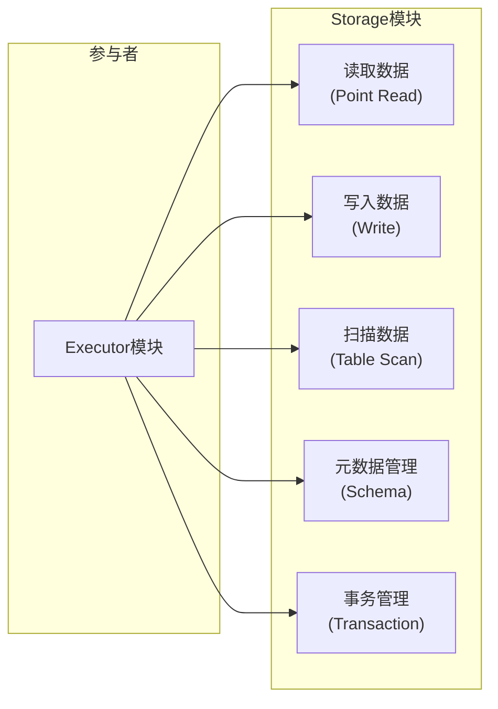
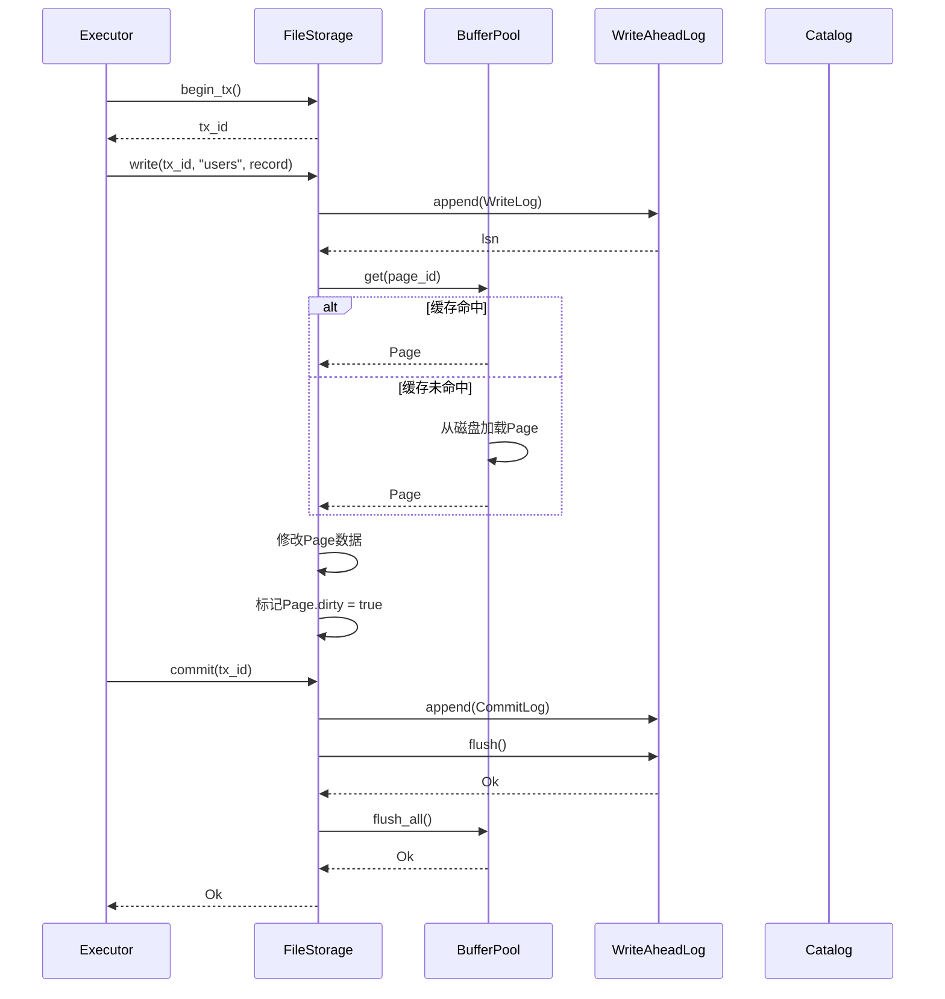
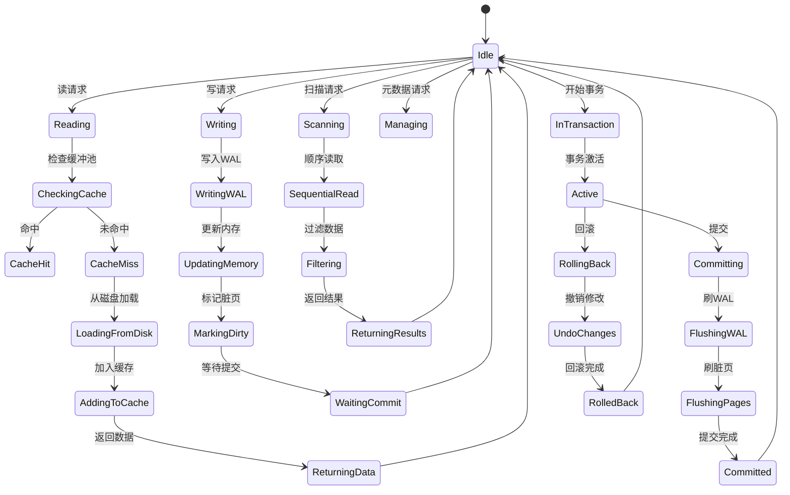

# Storage 模块设计文档

## 1. 模块概述

### 1.1 模块职责

Storage模块是SQLRustGo数据库系统的存储引擎，负责数据的持久化、检索、索引和事务管理，是整个系统的性能基石。

### 1.2 核心功能

| 功能 | 说明 |
|------|------|
| **数据读取** | 按条件读取表数据 |
| **数据写入** | 插入、更新、删除数据 |
| **数据扫描** | 全表扫描和范围扫描 |
| **元数据管理** | 管理表结构和索引定义 |
| **事务管理** | ACID事务支持 |
| **缓冲池** | 数据缓存提高读取性能 |

### 1.3 设计原则

- **可插拔架构**：支持多种存储引擎实现
- **ACID合规**：保证事务的原子性、一致性、隔离性、持久性
- **高性能**：通过缓存和索引优化访问性能
- **面向接口**：基于trait定义标准接口

---

## 2. OOA分析

### 2.1 用例图



### 2.2 概念类图

```mermaid
classDiagram
    class "存储引擎" as StorageEngine {
        <<interface>>
        +read(table, key)
        +write(table, record)
        +scan(table, filter)
        +create_table(name, schema)
    }
    
    class "表" as Table {
        +String name
        +Schema schema
        +List~Index~ indexes
    }
    
    class "索引" as Index {
        +String name
        +IndexType type
        +List~String~ columns
    }
    
    class "页面" as Page {
        +PageId id
        +List~Record~ records
        +bool dirty
    }
    
    class "缓冲池" as BufferPool {
        -LRU~PageId, Page~ cache
        +get_page(page_id)
        +put_page(page)
        +flush()
    }
    
    class "事务" as Transaction {
        +TransactionId id
        +IsolationLevel level
        +HashMap writes
        +commit()
        +rollback()
    }
    
    StorageEngine "1" --> "*" Table : 管理
    Table "1" --> "*" Index : 包含
    Table "1" --> "*" Page : 存储
    StorageEngine "1" --> "1" BufferPool : 使用
    StorageEngine "1" --> "*" Transaction : 管理
```

### 2.3 活动图

```mermaid
stateDiagram-v2
    [*] --> 接收存储请求
    
    接收存储请求 --> 判断请求类型
    
    state 判断请求类型 <<choice>>
        判断请求类型 --> 读取 : 读请求
        判断请求类型 --> 写入 : 写请求
        判断请求类型 --> 扫描 : 扫描请求
        判断请求类型 --> 元数据操作 : 管理请求
    
    读取 --> 检查缓冲池
    检查缓冲池 --> 命中缓存?:
    命中缓存? --> 返回缓存数据 : 是
    命中缓存? --> 从磁盘读取 : 否
    从磁盘读取 --> 加入缓存
    加入缓存 --> 返回数据
    
    写入 --> 开始事务
    开始事务 --> 写入WAL日志
    写入WAL日志 --> 修改内存数据
    修改内存数据 --> 标记页面脏位
    标记页面脏位 --> 提交事务
    
    扫描 --> 顺序扫描页面
    顺序扫描页面 --> 应用过滤条件
    应用过滤条件 --> 返回匹配数据
    
    元数据操作 --> 修改系统表
    修改系统表 --> 更新Catalog
    
    返回数据 --> [*]
    提交事务 --> [*]
    返回匹配数据 --> [*]
    更新Catalog --> [*]
```

---

## 3. OOD设计

### 3.1 设计类图

```mermaid
classDiagram
    class StorageEngine {
        <<trait>>
        +read(table: &str, key: &Key) Result~Record~
        +write(table: &str, record: Record) Result~()~
        +scan(table: &str, filter: Option~Expr~) Result~ScanIterator~
        +create_table(name: &str, schema: Schema) Result~()~
        +drop_table(name: &str) Result~()~
        +begin_tx() Result~TransactionId~
        +commit(tx_id: TransactionId) Result~()~
        +rollback(tx_id: TransactionId) Result~()~
    }
    
    class MemoryStorage {
        -tables: HashMap~String, Table~
        -transactions: HashMap~TransactionId, Transaction~
        -next_tx_id: TransactionId
        +read(table: &str, key: &Key) Result~Record~
        +write(table: &str, record: Record) Result~()~
        +scan(table: &str, filter: Option~Expr~) Result~ScanIterator~
        +create_table(name: &str, schema: Schema) Result~()~
    }
    
    class FileStorage {
        -data_dir: PathBuf
        -buffer_pool: BufferPool
        -catalog: Catalog
        -wal: WriteAheadLog
        -tables: HashMap~String, TableHandle~
        +read(table: &str, key: &Key) Result~Record~
        +write(table: &str, record: Record) Result~()~
        +scan(table: &str, filter: Option~Expr~) Result~ScanIterator~
        +create_table(name: &str, schema: Schema) Result~()~
    }
    
    class BufferPool {
        -pool_size: usize
        -frames: HashMap~PageId, Arc~Mutex~Page~~~
        -lru: LruCache~PageId~
        -eviction_policy: EvictionPolicy
        +get(page_id: PageId) Result~Arc~Mutex~Page~~~
        +put(page: Page) Result~()~
        +flush_all() Result~()~
        +evict() Result~()~
    }
    
    class Page {
        -page_id: PageId
        -data: Vec~u8~
        -row_count: u16
        -free_space: u16
        -dirty: bool
        -pin_count: u32
        +get_record(slot: u16) Result~Record~
        +insert_record(record: &Record) Result~u16~
        +delete_record(slot: u16) Result~()~
    }
    
    class Catalog {
        -tables: HashMap~String, TableSchema~
        -indexes: HashMap~String, IndexSchema~
        +register_table(schema: TableSchema)
        +get_table(name: &str) Option~TableSchema~
        +list_tables() Vec~String~
    }
    
    class WriteAheadLog {
        -log_file: File
        -next_lsn: Lsn
        +append(record: LogRecord) Result~Lsn~
        +flush() Result~()~
        +recover() Result~()~
    }
    
    class Transaction {
        -tx_id: TransactionId
        -isolation_level: IsolationLevel
        -write_set: HashMap~Key, Record~
        -read_set: HashSet~Key~
        -start_time: Instant
        -state: TxState
        +commit() Result~()~
        +rollback() Result~()~
    }
    
    enum IsolationLevel {
        ReadUncommitted
        ReadCommitted
        RepeatableRead
        Serializable
    }
    
    StorageEngine <|.. MemoryStorage
    StorageEngine <|.. FileStorage
    
    FileStorage --> BufferPool : 包含
    FileStorage --> Catalog : 使用
    FileStorage --> WriteAheadLog : 使用
    
    BufferPool --> Page : 管理
    Transaction --> IsolationLevel : 使用
```

### 3.2 顺序图



### 3.3 状态图



### 3.4 组件图

```mermaid
graph TD
    subgraph Storage组件
        Engine["存储引擎接口"]
        subgraph Implementations
            Memory["内存存储<br/>(MemoryStorage)"]
            File["文件存储<br/>(FileStorage)"]
        end
        Buffer["缓冲池<br/>(BufferPool)"]
        WAL["预写日志<br/>(WAL)"]
        Catalog["元数据目录<br/>(Catalog)"]
        Page["页面管理<br/>(Page)"]
        Tx["事务管理<br/>(Transaction)"]
    end
    
    subgraph Executor组件
        Exec["执行引擎"]
    end
    
    Exec --> Engine : 调用
    Engine --> Memory
    Engine --> File
    
    File --> Buffer
    File --> WAL
    File --> Catalog
    File --> Page
    File --> Tx
```

---

## 4. 核心接口设计

### 4.1 StorageEngine Trait

```rust
pub trait StorageEngine: Send + Sync {
    type Transaction: Transaction;
    
    fn read(&self, table: &str, key: &Key) -> Result<Option<Record>, StorageError>;
    
    fn write(&mut self, table: &str, record: Record) -> Result<(), StorageError>;
    
    fn delete(&mut self, table: &str, key: &Key) -> Result<bool, StorageError>;
    
    fn scan(&self, table: &str, predicate: Option<Predicate>) 
        -> Result<Box<dyn Iterator<Item = Result<Record, StorageError>>>, StorageError>;
    
    fn create_table(&mut self, name: &str, schema: Schema) -> Result<(), StorageError>;
    
    fn drop_table(&mut self, name: &str) -> Result<bool, StorageError>;
    
    fn begin_transaction(&mut self, level: IsolationLevel) 
        -> Result<Self::Transaction, StorageError>;
}
```

### 4.2 Transaction Trait

```rust
pub trait Transaction {
    fn id(&self) -> TransactionId;
    
    fn isolation_level(&self) -> IsolationLevel;
    
    fn commit(&mut self) -> Result<(), StorageError>;
    
    fn rollback(&mut self) -> Result<(), StorageError>;
}
```

### 4.3 BufferPool Trait

```rust
pub trait BufferPool {
    fn get(&mut self, page_id: PageId) -> Result<PageGuard, StorageError>;
    
    fn put(&mut self, page: Page) -> Result<(), StorageError>;
    
    fn flush(&mut self) -> Result<(), StorageError>;
    
    fn evict(&mut self) -> Result<usize, StorageError>;
}
```

---

## 5. 页式存储设计

### 5.1 页面布局

```
+-------------------+ 0字节
| PageHeader        |
| - page_id: u32    |
| - row_count: u16  |
| - free_offset: u16|
| - flags: u16      |
+-------------------+ 32字节
| Slot Directory    |
| [offset, length]  | <- 从后向前增长
+-------------------+
|                   |
|      空闲空间      |
|                   |
+-------------------+
| Row n             |
| Row n-1           | <- 从前向后增长
| ...               |
| Row 0             |
+-------------------+ 8192字节
```

### 5.2 页面参数

| 参数 | 值 | 说明 |
|------|----|------|
| 页面大小 | 8KB | 标准数据库页大小 |
| 页头大小 | 32字节 | 包含元数据 |
| Slot条目大小 | 4字节 | (2字节偏移, 2字节长度) |
| 每页最大行数 | ~200行 | 取决于行大小 |

---

## 6. 事务与并发控制

### 6.1 隔离级别

| 隔离级别 | 脏读 | 不可重复读 | 幻读 | 实现难度 |
|---------|------|-----------|------|---------|
| Read Uncommitted | 可能 | 可能 | 可能 | 极低 |
| Read Committed | 不可能 | 可能 | 可能 | 低 |
| Repeatable Read | 不可能 | 不可能 | 可能 | 中 |
| Serializable | 不可能 | 不可能 | 不可能 | 高 |

### 6.2 MVCC设计

- 每行数据包含创建版本号和删除版本号
- 读操作读取事务开始时的快照
- 写操作创建新版本，不阻塞读
- 后台线程定期清理过期版本

---

## 7. 测试策略

| 测试类型 | 测试内容 |
|---------|---------|
| **单元测试** | 页面操作、缓冲池、WAL |
| **并发测试** | 多线程读写、事务并发 |
| **ACID测试** | 事务原子性一致性 |
| **恢复测试** | 崩溃后数据恢复 |
| **性能测试** | 随机读写、顺序扫描 |
| **持久化测试** | 重启后数据完整性 |
