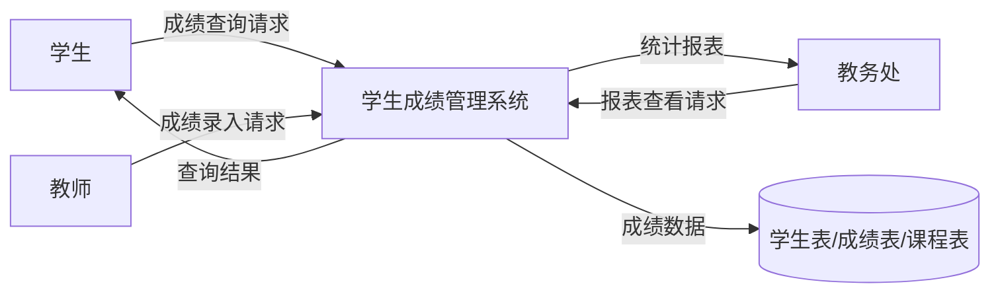

# DFD 上下文图

## 说明

上下文图展示了学生成绩管理系统与外部实体之间的交互关系：

1. **外部实体**：
   - 学生：向系统发送成绩查询请求，接收查询结果
   - 教师：向系统发送成绩录入请求
   - 教务处：向系统发送报表查看请求，接收统计报表

2. **系统**：学生成绩管理系统，处理外部实体的请求并与数据库进行数据交互

3. **数据存储**：学生表、成绩表、课程表，存储系统的核心数据
