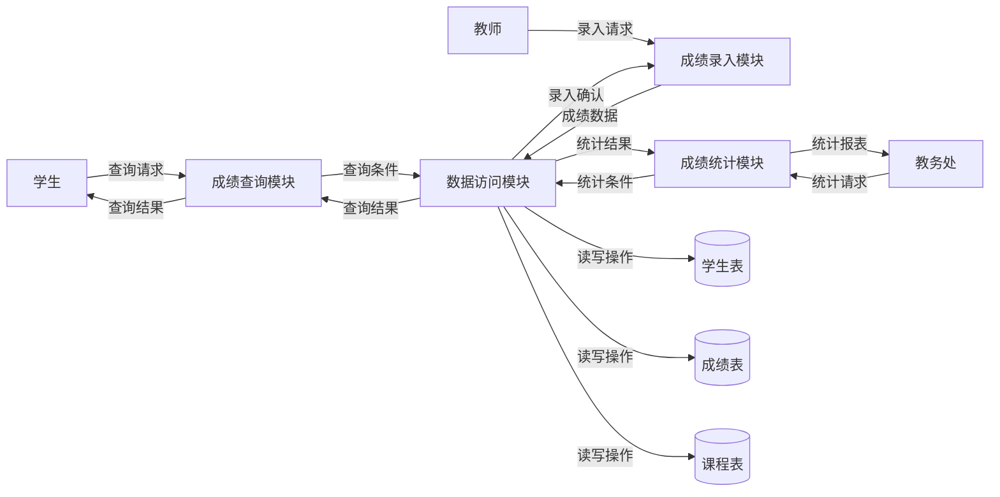

# DFD Level 1 图

## 说明

DFD Level 1图展示了学生成绩管理系统内部的主要功能模块及其数据流动关系：

1. **功能模块**：
   - 成绩查询模块：处理学生的成绩查询请求
   - 成绩录入模块：处理教师的成绩录入请求
   - 成绩统计模块：处理教务处的统计报表请求
   - 数据访问模块：统一管理对数据库的读写操作

2. **数据存储**：
   - 学生表：存储学生基本信息
   - 成绩表：存储学生选课成绩信息
   - 课程表：存储课程基本信息

3. **数据流**：展示了外部实体与功能模块之间、功能模块内部、功能模块与数据存储之间的数据流动
