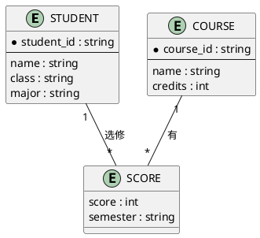
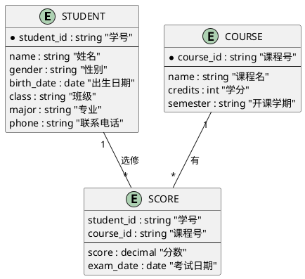

# ER 图（PlantUML 格式）

```plantuml
@startuml

entity STUDENT {
  * student_id : string
  --
  name : string
  class : string
  major : string
}

entity COURSE {
  * course_id : string
  --
  name : string
  credits : int
}

entity SCORE {
  score : int
  semester : string
}

STUDENT "1" -- "*" SCORE : 选修
COURSE "1" -- "*" SCORE : 有

@enduml
```

# ER 图（详细版，PlantUML 格式）

```plantuml
@startuml

entity STUDENT {
  * student_id : string "学号"
  --
  name : string "姓名"
  gender : string "性别"
  birth_date : date "出生日期"
  class : string "班级"
  major : string "专业"
  phone : string "联系电话"
}

entity COURSE {
  * course_id : string "课程号"
  --
  name : string "课程名"
  credits : int "学分"
  semester : string "开课学期"
}

entity SCORE {
  student_id : string "学号"
  course_id : string "课程号"
  --
  score : decimal "分数"
  exam_date : date "考试日期"
}

STUDENT "1" -- "*" SCORE : 选修
COURSE "1" -- "*" SCORE : 有

@enduml
```