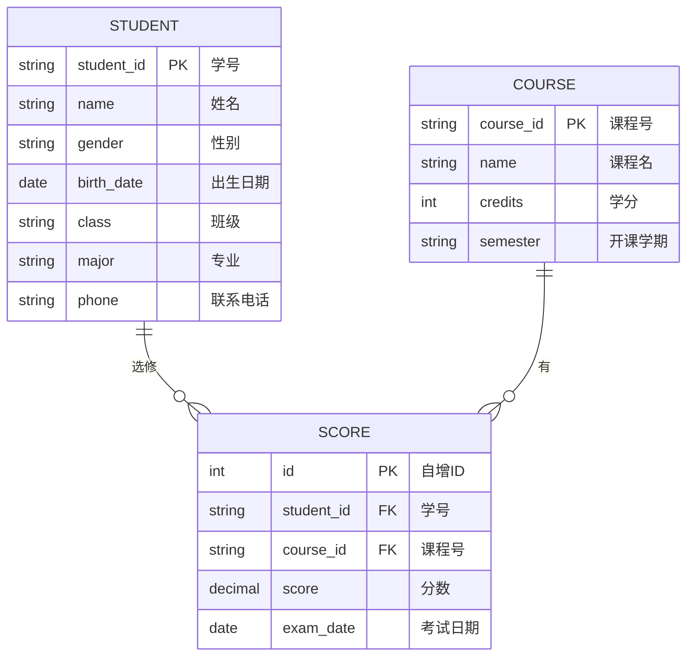

# ER 图

## 说明

ER图展示了学生成绩管理系统中的三个核心实体及其之间的关系：

1. **实体**：
   - 学生(STUDENT)：存储学生的基本信息，包括学号、姓名、性别、出生日期、班级、专业、联系电话
   - 课程(COURSE)：存储课程的基本信息，包括课程号、课程名、学分、开课学期
   - 成绩(SCORE)：存储学生选课的成绩信息，包括自增ID、学号、课程号、分数、考试日期

2. **关系**：
   - 学生与成绩：一个学生可以选修多门课程（有多个成绩），一个成绩属于一个学生
   - 课程与成绩：一门课程可以被多个学生选修（有多个成绩），一个成绩属于一门课程
