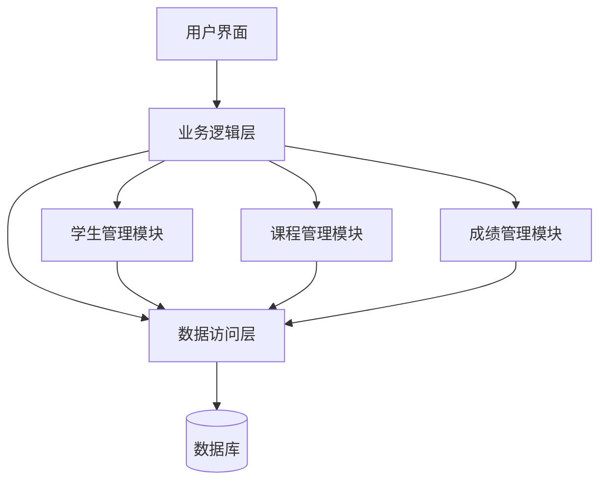

# 模块结构图

## 说明

模块结构图展示了学生成绩管理系统的分层架构和模块之间的调用关系：

1. **分层架构**：
   - 用户界面层：提供与用户交互的界面，接收用户输入并展示处理结果
   - 业务逻辑层：处理系统的核心业务逻辑，协调各功能模块
   - 数据访问层：封装对数据库的访问操作，提供统一的数据访问接口

2. **功能模块**：
   - 学生管理模块：负责学生信息的增删改查等操作
   - 课程管理模块：负责课程信息的增删改查等操作
   - 成绩管理模块：负责成绩信息的录入、查询、统计等操作

3. **调用关系**：
   - 用户界面调用业务逻辑层
   - 业务逻辑层调用各功能模块和数据访问层
   - 各功能模块调用数据访问层获取或存储数据
   - 数据访问层直接与数据库进行交互
