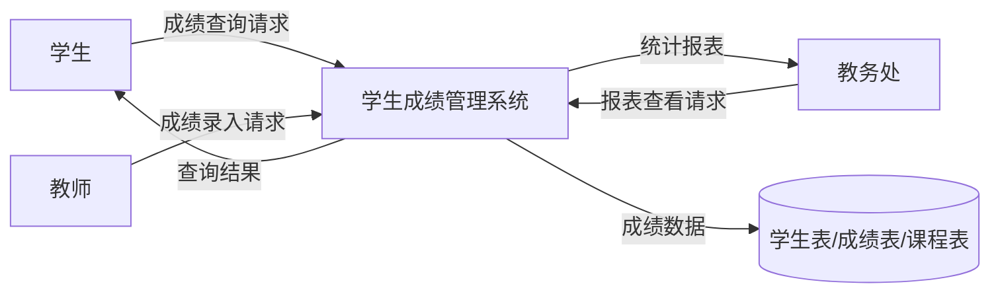
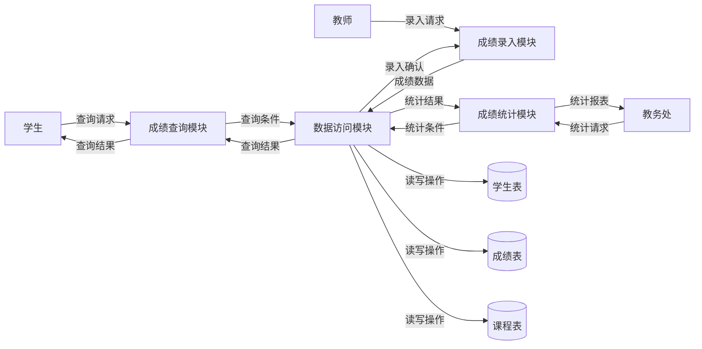
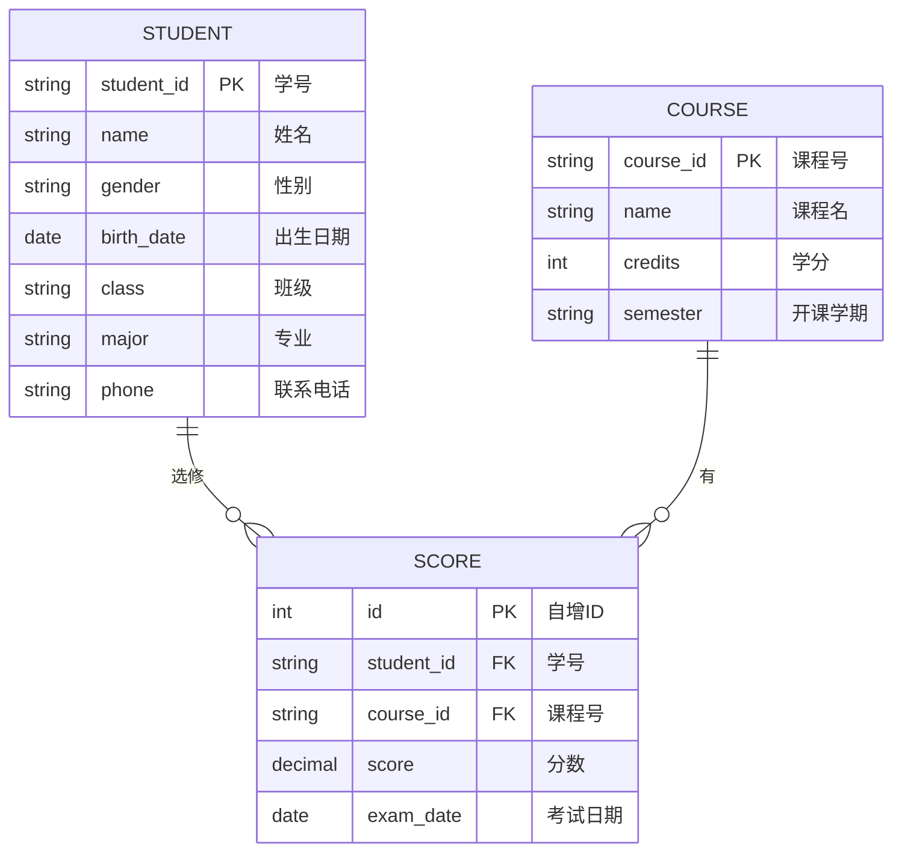

实验基本信息
| 项目 | 内容 |
|------|------|
| **实验名称** | 需求文档编写 —— 结构化分析方法实践 |
| **实验周次** | 第 2 周 |
| **实验日期** | 2026 年 3 月 21 日 |
| **学生姓名** | 姚汶辰 |
| **学号** | 202442020122 |
| **班级** | 24级软件工程1班 |
| **指导教师** | 李莹 |
---
一、实验目的
（列出本次实验的主要目的，3-5条）
1. 掌握结构化分析的基本方法（SA）
2. 能够使用AI辅助创建DFD图和ER图
3. 能够进行数据字典设计
4. 能够使用Trae生成数据库设计代码
5. 掌握AI-IDE工具的实践技巧
---
二、实验环境
2.1 硬件环境
| 项目 | 配置 |
|------|------|
| 计算机型号 | Lenovo Legion R9000P |
| CPU | AMD Ryzen 9 7940HX 16核32线程 |
| 内存 | 16GB DDR5 |
| 硬盘 | WD PC SN560 1TB NVMe SSD |
| GPU | NVIDIA GeForce RTX 4070 Laptop GPU |
2.2 软件环境
| 软件 | 版本 |
|------|------|
| 操作系统 | Microsoft Windows 11 专业版 10.0.26200 |
| Rust | 1.93.1 |
| Git | 2.52.0.windows.1 |
| IDE | Trae IDE |
---
三、实验内容
3.1 任务描述
本次实验主要完成学生成绩管理系统的结构化分析与设计，包括使用Mermaid语法生成DFD上下文图和Level 1图、ER图、数据字典、SQL建表语句以及模块结构图，并进行Git版本控制。

3.2 实验步骤
#### 步骤1：生成DFD上下文图
**操作命令/代码**：

**执行结果**：
成功生成DFD上下文图，清晰展示了系统与外部实体之间的交互关系。

**结果分析**：
图表正确，包含了学生、教师、教务处三个外部实体，以及系统与数据库之间的数据流动。

---
#### 步骤2：生成DFD Level 1图
**操作命令/代码**：

**执行结果**：
成功生成DFD Level 1图，展示了系统内部主要功能模块之间的数据流动。

**结果分析**：
图表正确，包含了成绩查询、成绩录入、成绩统计三个功能模块以及数据访问模块，清晰展示了模块间的数据流动。

---
#### 步骤3：生成ER图
**操作命令/代码**：

**执行结果**：
成功生成ER图，展示了学生、课程、成绩三个实体之间的关系。

**结果分析**：
图表正确，清晰展示了学生与课程之间的多对多关系（通过成绩表关联），实体属性定义完整。

---
#### 步骤4：生成SQL建表语句
**操作命令/代码**：
```sql
CREATE TABLE student (
    student_id VARCHAR(10) PRIMARY KEY,
    name VARCHAR(50) NOT NULL,
    gender ENUM('男', '女'),
    birth_date DATE,
    class VARCHAR(20),
    major VARCHAR(50),
    phone VARCHAR(20)
);

CREATE TABLE course (
    course_id VARCHAR(10) PRIMARY KEY,
    name VARCHAR(100) NOT NULL,
    credits INT DEFAULT 0,
    semester VARCHAR(20)
);

CREATE TABLE score (
    id INT AUTO_INCREMENT PRIMARY KEY,
    student_id VARCHAR(10),
    course_id VARCHAR(10),
    score DECIMAL(5,2),
    exam_date DATE,
    FOREIGN KEY (student_id) REFERENCES student(student_id),
    FOREIGN KEY (course_id) REFERENCES course(course_id)
);
```
**执行结果**：
成功生成SQL建表语句，包含主键、外键约束。

**结果分析**：
SQL语句正确，包含了student、course、score三张表的创建语句，约束条件完整。

---
四、实验结果
4.1 完成情况
| 任务 | 完成情况 | 说明 |
|------|----------|------|
| 生成DFD上下文图 | ☑ 完成 □ 未完成 | 已完成，图表正确 |
| 生成DFD Level 1图 | ☑ 完成 □ 未完成 | 已完成，图表正确 |
| 生成ER图 | ☑ 完成 □ 未完成 | 已完成，图表正确 |
| 设计数据字典 | ☑ 完成 □ 未完成 | 已完成，格式规范 |
| 生成SQL建表语句 | ☑ 完成 □ 未完成 | 已完成，语句正确 |
| 生成模块结构图 | ☑ 完成 □ 未完成 | 已完成，图表正确 |
| Git提交 | □ 完成 □ 未完成 | 待执行 |

4.2 关键成果
（列出本次实验产出的关键成果）
1. DFD上下文图和Level 1图（Mermaid格式）
2. ER图（Mermaid格式）
3. 数据字典（Markdown表格格式）
4. SQL建表语句（MySQL格式）
5. 模块结构图（Mermaid格式）

4.3 代码提交
| 项目 | 内容 |
|------|------|
| 分支名称 | docs/student-system-design-202442020122 |
| 提交哈希 | 待提交 |
| PR链接 | 待创建 |
---
五、遇到的问题与解决
5.1 问题记录
| 序号 | 问题描述 | 解决方法 | 参考资料 |
|------|----------|----------|----------|
| 1 | Mermaid图表语法不熟悉 | 通过AI工具学习正确的语法格式 | Mermaid官方文档 |
| 2 | SQL外键约束设置 | 参考MySQL官方文档和AI生成的示例 | MySQL官方文档 |

5.2 问题分析
在实验过程中，主要遇到的问题是对Mermaid图表语法的不熟悉，特别是ER图和DFD图的语法格式。通过与AI工具的交互，逐步学习了正确的语法格式，并成功生成了符合要求的图表。

---
六、实验总结
6.1 知识收获
1. 掌握了结构化分析的基本方法，包括DFD图、ER图、数据字典的设计
2. 学习了Mermaid图表语法，能够使用Mermaid生成各种技术图表
3. 掌握了SQL建表语句的编写，包括主键、外键约束的设置

6.2 技能提升
1. 提升了使用AI辅助工具进行系统分析与设计的能力
2. 提高了Markdown文档编写能力
3. 增强了数据库设计能力

6.3 心得体会
通过本次实验，我深刻体会到了AI辅助工具在系统分析与设计过程中的高效性。通过提供清晰的需求描述，AI能够快速生成符合要求的图表和代码，大大提高了工作效率。但同时也需要具备扎实的专业知识，以便能够准确地描述需求和验证AI生成的结果。

6.4 改进建议
1. 建议增加更多的Mermaid图表示例，帮助学生更快掌握语法
2. 建议增加对AI生成结果的验证环节，培养学生的批判性思维

---
七、AI工具使用记录
7.1 AI工具使用情况
| AI工具 | 使用场景 | 效果评价 |
|--------|----------|----------|
| Trae AI | 生成DFD图 | 优秀，快速生成符合要求的图表 |
| Trae AI | 生成ER图 | 优秀，实体关系描述准确 |
| Trae AI | 生成SQL建表语句 | 优秀，约束条件完整 |
| Trae AI | 生成模块结构图 | 优秀，模块关系清晰 |

7.2 AI辅助示例
**输入提示词**：
```
请为"学生成绩管理系统"生成数据流图（DFD）的上下文图，使用Mermaid语法。
系统名称：学生成绩管理系统
外部实体：学生、教师、教务处
数据存储：学生表、成绩表、课程表
主要功能：成绩录入、成绩查询、成绩统计
请输出Mermaid代码。
```

**AI输出结果**：


**使用效果**：
AI输出的图表代码质量很高，完全符合需求，只需稍加调整即可使用。

---
八、参考资料
1. 软件工程导论（第6版），张海藩
2. Mermaid官方文档：https://mermaid.js.org/
3. MySQL官方文档：https://dev.mysql.com/doc/
4. Trae AI使用指南

---
九、教师评语
（教师填写）
| 评价项目 | 得分 |
|----------|------|
| 实验完成度 | /40 |
| 报告规范性 | /20 |
| 问题解决能力 | /20 |
| 创新性 | /10 |
| 总结深度 | /10 |
| **总分** | **/100** |
**教师签名**：________________    **日期**：________________
---
附录
附录A：完整代码
```sql
-- 学生表
CREATE TABLE student (
    student_id VARCHAR(10) PRIMARY KEY,
    name VARCHAR(50) NOT NULL,
    gender ENUM('男', '女'),
    birth_date DATE,
    class VARCHAR(20),
    major VARCHAR(50),
    phone VARCHAR(20)
);

-- 课程表
CREATE TABLE course (
    course_id VARCHAR(10) PRIMARY KEY,
    name VARCHAR(100) NOT NULL,
    credits INT DEFAULT 0,
    semester VARCHAR(20)
);

-- 成绩表
CREATE TABLE score (
    id INT AUTO_INCREMENT PRIMARY KEY,
    student_id VARCHAR(10),
    course_id VARCHAR(10),
    score DECIMAL(5,2),
    exam_date DATE,
    FOREIGN KEY (student_id) REFERENCES student(student_id),
    FOREIGN KEY (course_id) REFERENCES course(course_id)
);
```

附录B：运行日志
```
# 生成DFD上下文图 - 成功
# 生成DFD Level 1图 - 成功
# 生成ER图 - 成功
# 生成数据字典 - 成功
# 生成SQL建表语句 - 成功
# 生成模块结构图 - 成功
```

附录C：相关截图
（在此粘贴实验过程中的关键截图，如Mermaid图表渲染结果、Git提交记录等）
---
**报告提交日期**：2026 年 3 月 21 日
**学生签名**：姚汶辰
