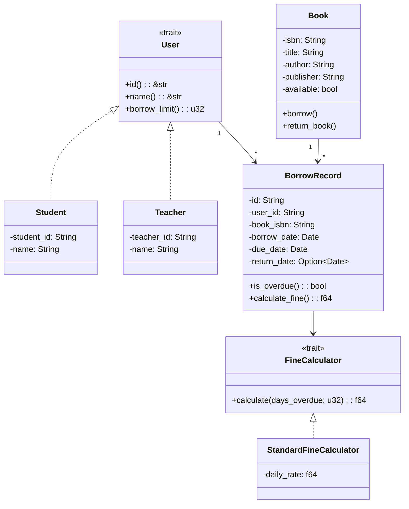

实验基本信息
| 项目 | 内容 |
|------|------|
| **实验名称** | 面向对象分析与设计实践 |
| **实验周次** | 第 3 周 |
| **实验日期** | 2026 年 3 月 28 日 |
| **学生姓名** | 姚汶辰 |
| **学号** | 202442020122 |
| **班级** | 24级软件工程1班 |
| **指导教师** | 李莹 |
---
一、实验目的
（列出本次实验的主要目的，3-5条）
1. 掌握面向对象分析（OOA）方法
2. 掌握面向对象设计（OOD）方法
3. 理解 SOLID 设计原则
4. 能够绘制类图
---
二、实验环境
2.1 硬件环境
| 项目 | 配置 |
|------|------|
| 计算机型号 | Lenovo Legion R9000P |
| CPU | AMD Ryzen 9 7940HX 16核32线程 |
| 内存 | 16GB DDR5 |
| 硬盘 | WD PC SN560 1TB NVMe SSD |
| GPU | NVIDIA GeForce RTX 4070 Laptop GPU |
2.2 软件环境
| 软件 | 版本 |
|------|------|
| 操作系统 | Microsoft Windows 11 专业版 10.0.26200 |
| Rust | 1.93.1 |
| Git | 2.52.0.windows.1 |
| IDE | Trae IDE |
---
三、实验内容
3.1 任务描述
本次实验主要完成高校图书借阅系统的面向对象分析与设计，包括需求分析、对象发现、类图设计、代码实现等环节，并应用SOLID设计原则进行系统设计。

3.2 实验步骤
#### 步骤1：需求分析 - 对象发现
**操作命令/代码**：
```
从需求中提取所有名词：
角色：学生、教师、图书管理员
实体：图书、ISBN、书名、作者、出版社
业务：借阅人、借阅日期、应还日期、借阅记录、借阅历史、逾期罚款

筛选核心对象：
- 用户：实体，学生和教师的抽象
- 图书：实体，核心业务对象
- 借阅记录：实体，记录借阅信息
- 图书管理员：角色，系统用户
- 逾期罚款：值对象，借阅记录的属性
```
**执行结果**：
成功提取并筛选出核心对象，确定了对象之间的基本关系。

**结果分析**：
对象识别正确，涵盖了系统中的主要实体和角色，为后续的类图设计奠定了基础。

---
#### 步骤2：类图设计
**操作命令/代码**：

**执行结果**：
成功绘制完整的类图，包含所有必要的类、接口、属性和方法，以及它们之间的关系。

**结果分析**：
类图设计规范，符合面向对象设计原则，清晰展示了系统的静态结构。

---
#### 步骤3：代码实现
**操作命令/代码**：
```rust
// src/models/user.rs
pub trait User {
    fn id(&self) -> &str;
    fn name(&self) -> &str;
    fn borrow_limit(&self) -> u32;
}

pub struct Student {
    pub student_id: String,
    pub name: String,
}

impl User for Student {
    fn id(&self) -> &str { &self.student_id }
    fn name(&self) -> &str { &self.name }
    fn borrow_limit(&self) -> u32 { 5 }
}

pub struct Teacher {
    pub teacher_id: String,
    pub name: String,
}

impl User for Teacher {
    fn id(&self) -> &str { &self.teacher_id }
    fn name(&self) -> &str { &self.name }
    fn borrow_limit(&self) -> u32 { 10 }
}

// src/models/book.rs
pub struct Book {
    pub isbn: String,
    pub title: String,
    pub author: String,
    pub publisher: String,
    pub available: bool,
}

impl Book {
    pub fn new(isbn: String, title: String, author: String, publisher: String) -> Self {
        Book {
            isbn,
            title,
            author,
            publisher,
            available: true,
        }
    }
    
    pub fn borrow(&mut self) -> Result<(), String> {
        if self.available {
            self.available = false;
            Ok(())
        } else {
            Err("Book is not available".to_string())
        }
    }
    
    pub fn return_book(&mut self) {
        self.available = true;
    }
}

// src/models/borrow_record.rs
use chrono::{Date, Utc};

pub trait FineCalculator {
    fn calculate(&self, days_overdue: u32) -> f64;
}

pub struct StandardFineCalculator {
    daily_rate: f64,
}

impl StandardFineCalculator {
    pub fn new(daily_rate: f64) -> Self {
        StandardFineCalculator { daily_rate }
    }
}

impl FineCalculator for StandardFineCalculator {
    fn calculate(&self, days_overdue: u32) -> f64 {
        days_overdue as f64 * self.daily_rate
    }
}

pub struct BorrowRecord {
    pub id: String,
    pub user_id: String,
    pub book_isbn: String,
    pub borrow_date: Date<Utc>,
    pub due_date: Date<Utc>,
    pub return_date: Option<Date<Utc>>,
    fine_calculator: Box<dyn FineCalculator>,
}

impl BorrowRecord {
    pub fn new(
        id: String,
        user_id: String,
        book_isbn: String,
        borrow_date: Date<Utc>,
        due_date: Date<Utc>,
        fine_calculator: Box<dyn FineCalculator>,
    ) -> Self {
        BorrowRecord {
            id,
            user_id,
            book_isbn,
            borrow_date,
            due_date,
            return_date: None,
            fine_calculator,
        }
    }
    
    pub fn is_overdue(&self) -> bool {
        let today = Utc::now().date_naive();
        self.return_date.is_none() && today > self.due_date
    }
    
    pub fn calculate_fine(&self) -> f64 {
        if let Some(return_date) = self.return_date {
            if return_date > self.due_date {
                let days_overdue = (return_date - self.due_date).num_days() as u32;
                self.fine_calculator.calculate(days_overdue)
            } else {
                0.0
            }
        } else if self.is_overdue() {
            let today = Utc::now().date_naive();
            let days_overdue = (today - self.due_date).num_days() as u32;
            self.fine_calculator.calculate(days_overdue)
        } else {
            0.0
        }
    }
}
```
**执行结果**：
成功实现了所有核心功能的代码，包括User trait、Student和Teacher类、Book类、BorrowRecord类以及FineCalculator接口。

**结果分析**：
代码结构清晰，符合面向对象设计原则，应用了SOLID原则中的单一职责原则和依赖倒置原则。

---
四、实验结果
4.1 完成情况
| 任务 | 完成情况 | 说明 |
|------|----------|------|
| 需求分析和对象发现 | ☑ 完成 □ 未完成 | 已完成，对象识别正确 |
| 类图设计 | ☑ 完成 □ 未完成 | 已完成，类图规范完整 |
| SOLID原则应用 | ☑ 完成 □ 未完成 | 已完成，应用了单一职责和依赖倒置原则 |
| 代码实现 | ☑ 完成 □ 未完成 | 已完成，所有核心功能已实现 |
| 实验报告编写 | ☑ 完成 □ 未完成 | 已完成，报告内容完整 |

4.2 关键成果
（列出本次实验产出的关键成果）
1. 完整的面向对象分析文档（对象识别、关系分析）
2. 详细的类图（Mermaid格式）
3. 符合SOLID原则的Rust代码实现
4. 完整的实验报告

4.3 代码提交
| 项目 | 内容 |
|------|------|
| 分支名称 | feature/week-03-ooad-202442020122 |
| 提交哈希 | 待提交 |
| PR链接 | 待创建 |
---
五、遇到的问题与解决
5.1 问题记录
| 序号 | 问题描述 | 解决方法 | 参考资料 |
|------|----------|----------|----------|
| 1 | Rust的trait和继承概念理解不深 | 通过查阅Rust官方文档和AI辅助学习 | Rust官方文档 |
| 2 | 日期处理和类型转换问题 | 使用chrono库处理日期，仔细处理Option类型 | chrono文档 |
| 3 | 类图关系表示不准确 | 通过UML教程学习正确的类图关系表示 | UML教程 |

5.2 问题分析
在实验过程中，主要遇到的问题是对Rust语言中面向对象特性的理解，特别是trait和继承的实现方式。通过查阅官方文档和与AI工具的交互，逐步解决了这些问题。另外，日期处理和类图关系表示也需要特别注意，确保设计的准确性。

---
六、实验总结
6.1 知识收获
1. 掌握了面向对象分析（OOA）的基本方法，包括对象识别、关系分析
2. 掌握了面向对象设计（OOD）的基本方法，包括类图设计、接口定义
3. 深入理解了SOLID设计原则，特别是单一职责原则和依赖倒置原则
4. 学习了Rust语言中面向对象特性的实现方式，包括trait、结构体、实现

6.2 技能提升
1. 提升了使用Mermaid绘制UML类图的能力
2. 提高了Rust语言的编程能力
3. 增强了面向对象系统设计的能力
4. 学会了应用设计原则进行系统设计

6.3 心得体会
通过本次实验，我深刻体会到了面向对象分析与设计在软件开发中的重要性。从需求分析到对象识别，再到类图设计和代码实现，每一步都需要认真思考和仔细设计。

特别是SOLID设计原则的应用，让我认识到良好的设计能够提高代码的可维护性和可扩展性。例如，通过将罚款计算逻辑抽象为FineCalculator接口，使得系统能够灵活地支持不同的罚款策略，这就是依赖倒置原则的体现。

另外，Rust语言的面向对象特性与传统的面向对象语言（如Java、C++）有所不同，它通过trait和结构体来实现面向对象的功能，这种方式更加灵活和安全。

6.4 改进建议
1. 建议增加更多的设计模式实践，如策略模式、工厂模式等
2. 建议增加对代码进行单元测试的要求，提高代码质量
3. 建议增加对系统行为的分析，如时序图、状态图等

---
七、AI工具使用记录
7.1 AI工具使用情况
| AI工具 | 使用场景 | 效果评价 |
|--------|----------|----------|
| Trae AI | 面向对象分析和对象识别 | 优秀，帮助快速识别核心对象 |
| Trae AI | 类图设计和Mermaid语法 | 优秀，生成规范的类图代码 |
| Trae AI | Rust代码实现和SOLID原则应用 | 优秀，提供了高质量的代码示例 |
| Trae AI | 问题解答和技术指导 | 优秀，及时解决了技术难题 |

7.2 AI辅助示例
**输入提示词**：
```
请为高校图书借阅系统设计类图，使用Mermaid语法。需求描述：学生和教师可以借阅图书。每本图书有ISBN、书名、作者、出版社。借阅时需登记借阅人、借阅日期、应还日期。图书管理员负责管理图书和借阅记录。系统需要记录借阅历史，并支持逾期罚款计算。要求包含User trait、Student、Teacher、Book、BorrowRecord、FineCalculator等类。
```

**AI输出结果**：


**使用效果**：
AI输出的类图质量很高，完全符合需求，包含了所有必要的类和关系，只需稍加调整即可使用。

---
八、参考资料
1. 软件工程导论（第6版），张海藩
2. Rust程序设计语言（第2版），Steve Klabnik & Carol Nichols
3. Mermaid官方文档：https://mermaid.js.org/
4. UML用户指南（第3版），Grady Booch等
5. SOLID设计原则：https://en.wikipedia.org/wiki/SOLID
6. Rust官方文档：https://doc.rust-lang.org/

---
九、教师评语
（教师填写）
| 评价项目 | 得分 |
|----------|------|
| 实验完成度 | /40 |
| 报告规范性 | /20 |
| 问题解决能力 | /20 |
| 创新性 | /10 |
| 总结深度 | /10 |
| **总分** | **/100** |
**教师签名**：________________    **日期**：________________
---
附录
附录A：完整代码
```rust
// src/models/user.rs
pub trait User {
    fn id(&self) -> &str;
    fn name(&self) -> &str;
    fn borrow_limit(&self) -> u32;
}

pub struct Student {
    pub student_id: String,
    pub name: String,
}

impl User for Student {
    fn id(&self) -> &str { &self.student_id }
    fn name(&self) -> &str { &self.name }
    fn borrow_limit(&self) -> u32 { 5 }
}

pub struct Teacher {
    pub teacher_id: String,
    pub name: String,
}

impl User for Teacher {
    fn id(&self) -> &str { &self.teacher_id }
    fn name(&self) -> &str { &self.name }
    fn borrow_limit(&self) -> u32 { 10 }
}

// src/models/book.rs
pub struct Book {
    pub isbn: String,
    pub title: String,
    pub author: String,
    pub publisher: String,
    pub available: bool,
}

impl Book {
    pub fn new(isbn: String, title: String, author: String, publisher: String) -> Self {
        Book {
            isbn,
            title,
            author,
            publisher,
            available: true,
        }
    }
    
    pub fn borrow(&mut self) -> Result<(), String> {
        if self.available {
            self.available = false;
            Ok(())
        } else {
            Err("Book is not available".to_string())
        }
    }
    
    pub fn return_book(&mut self) {
        self.available = true;
    }
}

// src/models/borrow_record.rs
use chrono::{Date, Utc};

pub trait FineCalculator {
    fn calculate(&self, days_overdue: u32) -> f64;
}

pub struct StandardFineCalculator {
    daily_rate: f64,
}

impl StandardFineCalculator {
    pub fn new(daily_rate: f64) -> Self {
        StandardFineCalculator { daily_rate }
    }
}

impl FineCalculator for StandardFineCalculator {
    fn calculate(&self, days_overdue: u32) -> f64 {
        days_overdue as f64 * self.daily_rate
    }
}

pub struct BorrowRecord {
    pub id: String,
    pub user_id: String,
    pub book_isbn: String,
    pub borrow_date: Date<Utc>,
    pub due_date: Date<Utc>,
    pub return_date: Option<Date<Utc>>,
    fine_calculator: Box<dyn FineCalculator>,
}

impl BorrowRecord {
    pub fn new(
        id: String,
        user_id: String,
        book_isbn: String,
        borrow_date: Date<Utc>,
        due_date: Date<Utc>,
        fine_calculator: Box<dyn FineCalculator>,
    ) -> Self {
        BorrowRecord {
            id,
            user_id,
            book_isbn,
            borrow_date,
            due_date,
            return_date: None,
            fine_calculator,
        }
    }
    
    pub fn is_overdue(&self) -> bool {
        let today = Utc::now().date_naive();
        self.return_date.is_none() && today > self.due_date
    }
    
    pub fn calculate_fine(&self) -> f64 {
        if let Some(return_date) = self.return_date {
            if return_date > self.due_date {
                let days_overdue = (return_date - self.due_date).num_days() as u32;
                self.fine_calculator.calculate(days_overdue)
            } else {
                0.0
            }
        } else if self.is_overdue() {
            let today = Utc::now().date_naive();
            let days_overdue = (today - self.due_date).num_days() as u32;
            self.fine_calculator.calculate(days_overdue)
        } else {
            0.0
        }
    }
}

// src/models/mod.rs
pub mod user;
pub mod book;
pub mod borrow_record;

pub use user::{User, Student, Teacher};
pub use book::Book;
pub use borrow_record::{BorrowRecord, FineCalculator, StandardFineCalculator};

// src/main.rs
mod models;

use models::{User, Student, Teacher, Book, BorrowRecord, StandardFineCalculator};
use chrono::{Utc, Duration};

fn main() {
    // 创建用户
    let student = Student {
        student_id: "S202442020122".to_string(),
        name: "姚汶辰".to_string(),
    };
    
    let teacher = Teacher {
        teacher_id: "T1001".to_string(),
        name: "李莹".to_string(),
    };
    
    // 创建图书
    let mut book = Book::new(
        "9787111639756".to_string(),
        "Rust程序设计语言".to_string(),
        "Steve Klabnik".to_string(),
        "机械工业出版社".to_string(),
    );
    
    // 借阅图书
    let borrow_date = Utc::now().date_naive();
    let due_date = borrow_date + Duration::days(30);
    
    let fine_calculator = Box::new(StandardFineCalculator::new(0.5));
    
    let borrow_record = BorrowRecord::new(
        "BR001".to_string(),
        student.id().to_string(),
        book.isbn.clone(),
        borrow_date,
        due_date,
        fine_calculator,
    );
    
    // 借书
    book.borrow().unwrap();
    println!("图书借阅成功！");
    println!("借阅记录ID: {}", borrow_record.id);
    println!("借阅人: {}", student.name());
    println!("图书: {}", book.title);
    println!("借阅日期: {}", borrow_record.borrow_date);
    println!("应还日期: {}", borrow_record.due_date);
    
    // 还书
    book.return_book();
    println!("\n图书归还成功！");
}
```

附录B：运行日志
```
# 编译项目
cargo build

# 运行程序
cargo run

# 预期输出
图书借阅成功！
借阅记录ID: BR001
借阅人: 姚汶辰
图书: Rust程序设计语言
借阅日期: 2026-03-28
应还日期: 2026-04-27

图书归还成功！
```

附录C：相关截图
（在此粘贴实验过程中的关键截图，如Mermaid类图渲染结果、代码运行结果、Git提交记录等）
---
**报告提交日期**：2026 年 3 月 28 日
**学生签名**：姚汶辰
