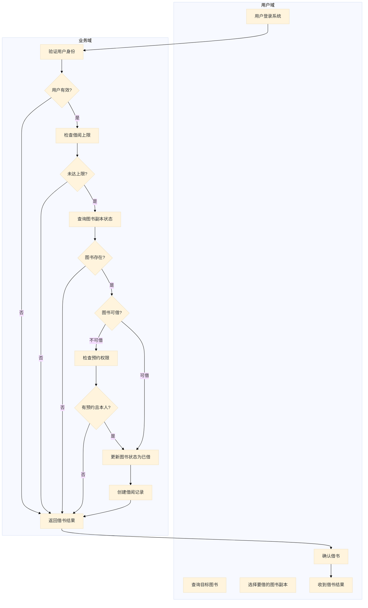
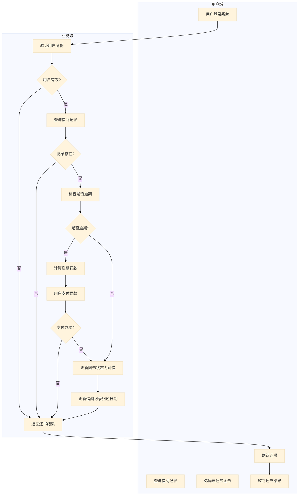
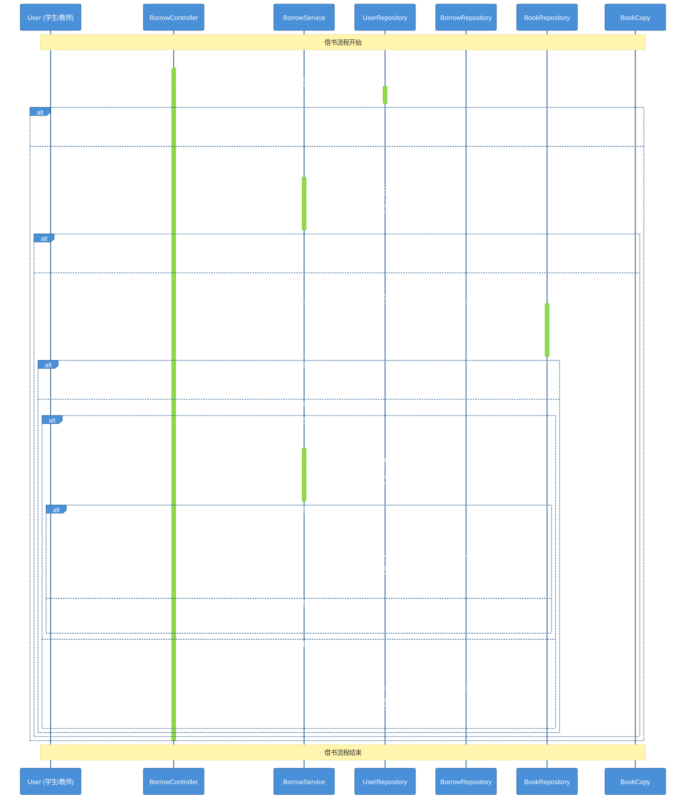
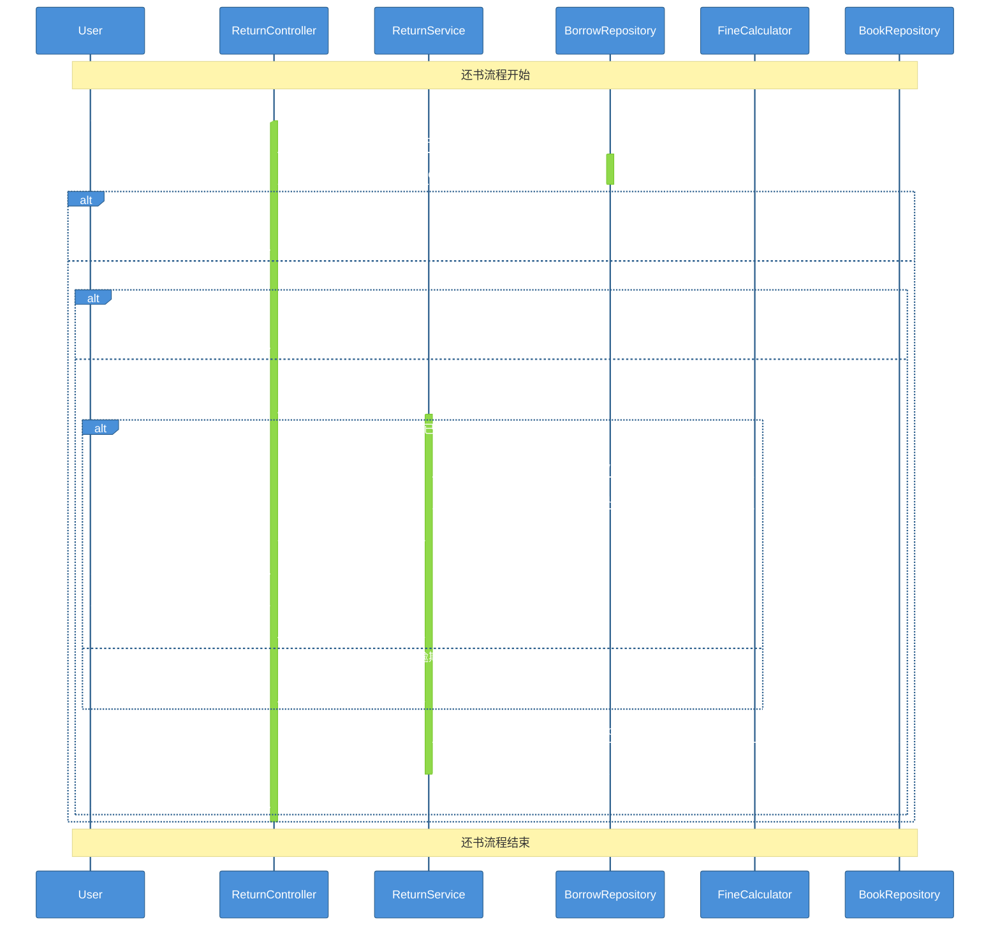
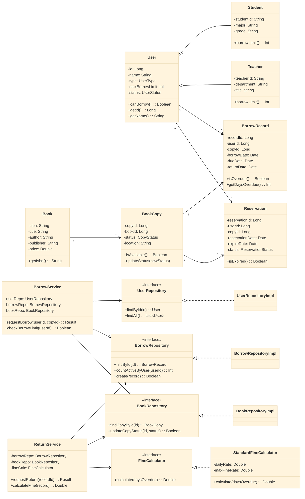
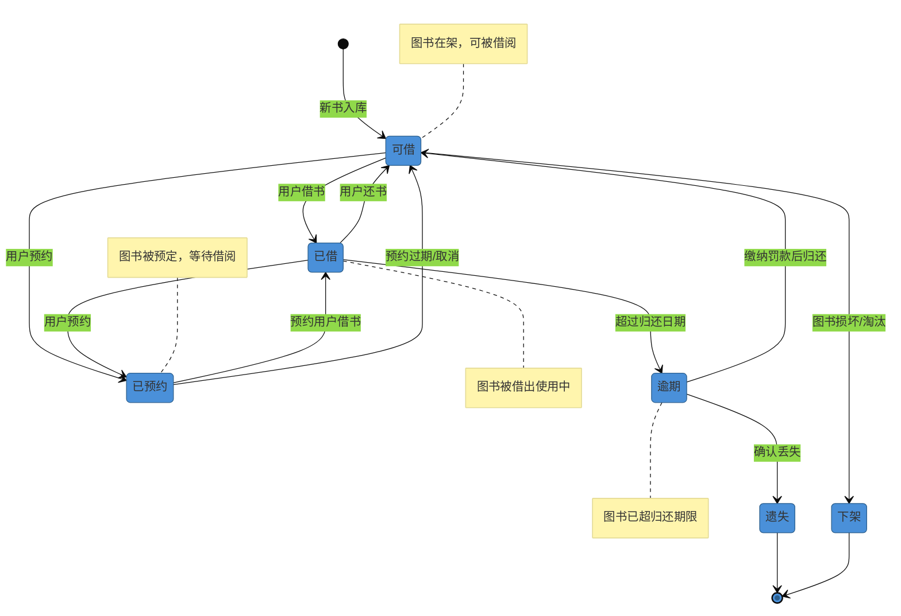

# 实验报告：UML建模与OOA-OOD实践

---

## 实验基本信息

| 项目 | 内容 |
|------|------|
| **实验名称** | UML建模与OOA-OOD实践 |
| **实验周次** | 第 4 周 |
| **实验日期** | 2026 年 4 月 1 日 |
| **学生姓名** | 姚汶辰 |
| **学号** | 202442020122 |
| **班级** | 24级软件工程1班 |
| **指导教师** | 李莹 |

---

## 一、实验目的

1. 掌握用例图绘制方法，理解参与者和用例的识别方法
2. 掌握活动图绘制方法，从流程视角分析业务逻辑
3. 理解架构设计的重要性，掌握三层架构设计原则
4. 掌握顺序图绘制方法，从对象视角分析交互过程
5. 掌握类图的更新方法，体现协作关系和职责划分
6. 掌握状态图绘制方法，理解对象生命周期
7. 理解OOA→OOD→OOP的完整转换过程

---

## 二、实验环境

### 2.1 硬件环境

| 设备 | 配置信息 |
|------|---------|
| 电脑型号 | Lenovo Legion R9000P |
| CPU | AMD Ryzen 9 7940HX 16核32线程 |
| 内存 | 16GB DDR5 |
| 硬盘 | WD PC SN560 1TB NVMe SSD |
| GPU | NVIDIA GeForce RTX 4070 Laptop GPU |
| 网卡 | MediaTek Wi-Fi 6 MT7922 Wireless LAN Card |

### 2.2 软件环境

| 软件 | 版本信息 |
|------|---------|
| 操作系统 | Microsoft Windows 11 专业版 23H2 |
| Rust 工具链 | rustc 1.93.1 (2025-03-16) |
| IDE | Trae IDE 1.0 |
| Git | git version 2.52.0.windows.1 |
| Mermaid 插件 | Mermaid Support for VS Code |

---

## 三、实验内容和步骤

本次实验以**高校图书借阅系统**为案例，按照正确的OOA→OOD细化顺序完成UML建模。

### 核心方法论：正确的建模顺序

```
┌─────────────┐     ┌─────────────┐     ┌─────────────┐     ┌─────────────┐
│   用例图    │ ──▶ │   活动图    │ ──▶ │  架构设计   │ ──▶ │   顺序图    │
└─────────────┘     └─────────────┘     └─────────────┘     └─────────────┘
       │                   │                   │                   │
       ▼                   ▼                   ▼                   ▼
  "谁可以做什么"     "先做什么后做什么"    "分成哪几层"       "谁和谁交互"
```

---

### 步骤1：用例图绘制

#### 1.1 需求分析

**参与者**：学生、教师、图书管理员

**用例**：登录、查询图书、借书、还书、管理图书、预约图书、查看借阅历史、计算罚款

**关系**：
- 学生和教师：登录、查询图书、借书、还书、预约图书、查看借阅历史
- 图书管理员：登录、管理图书、查看所有借阅记录
- 借书和还书都包含查询图书（<<include>>）
- 还书包含计算罚款（<<include>>）
- 预约图书扩展借书（<<extend>>）

#### 1.2 用例图（Mermaid）

```mermaid
%%{init: {'theme': 'base', 'themeVariables': { 'primaryColor': '#4A90D9', 'primaryTextColor': '#fff', 'primaryBorderColor': '#2C5F8D'}}}%%
graph LR
    subgraph "参与者"
        Student("学生")
        Teacher("教师")
        Librarian("图书管理员")
    end

    subgraph "用例"
        Login("登录")
        QueryBook("查询图书")
        BorrowBook("借书")
        ReturnBook("还书")
        ManageBook("管理图书")
        ReserveBook("预约图书")
        ViewHistory("查看借阅历史")
        ViewAllRecords("查看所有借阅记录")
        CalculateFine("计算罚款")
    end

    Student --> Login & QueryBook & BorrowBook & ReturnBook & ReserveBook & ViewHistory
    Teacher --> Login & QueryBook & BorrowBook & ReturnBook & ReserveBook & ViewHistory
    Librarian --> Login & ManageBook & ViewAllRecords

    BorrowBook ..> QueryBook : <<include>>
    ReturnBook ..> QueryBook : <<include>>
    ReturnBook ..> CalculateFine : <<include>>
    ReserveBook -.-> BorrowBook : <<extend>>
```

#### 1.3 用例图说明

| 关系类型 | 符号 | 说明 |
|---------|------|------|
| 关联 | `-->` | 参与者与用例之间的交互关系 |
| 包含 | `..>` | 用例之间的包含关系，表示基础用例执行时必须执行被包含用例 |
| 扩展 | `-.->` | 用例之间的扩展关系，表示扩展用例在特定条件下可选地扩展基础用例 |

---

### 步骤2：活动图设计（流程视角）

#### 2.1 借书流程分析

活动图回答的核心问题：
1. 借书包含哪些步骤？
2. 借书过程中有哪些分支判断？
3. 不关心"谁来做"，只关心"做什么"

#### 2.2 借书流程活动图



#### 2.3 还书流程活动图



---

### 步骤3：架构设计

#### 3.1 三层架构设计

```
┌─────────────────────────────────────────────────────────────────────────────┐
│                        三层架构（Three-Tier Architecture）                   │
├─────────────────────────────────────────────────────────────────────────────┤
│                                                                             │
│   表现层 (Controller)    业务层 (Service)    数据层 (Repository)           │
│   ═════════════════     ══════════════     ══════════════                 │
│                                                                             │
│   ┌─────────────────┐    ┌─────────────────┐  ┌─────────────────┐        │
│   │ BorrowController │    │  BorrowService  │  │ UserRepository  │        │
│   │                  │    │                 │  │  (接口)         │        │
│   │ - requestBorrow │    │ - 借阅业务逻辑   │  │                 │        │
│   │ - requestReturn │    │ - 检查借阅上限   │  │ - findById     │        │
│   │ - 参数校验      │    │ - 检查预约权限   │  │ - countBorrow   │        │
│   │ - 返回响应      │    │ - 计算罚款       │  │                 │        │
│   └─────────────────┘    └─────────────────┘  └─────────────────┘        │
│                                                                             │
│   ┌─────────────────┐    ┌─────────────────┐  ┌─────────────────┐        │
│   │  BookController  │    │   BookService   │  │ BookRepository  │        │
│   │                  │    │                 │  │  (接口)         │        │
│   │ - queryBook     │    │ - 图书查询逻辑   │  │                 │        │
│   │ - manageBook    │    │ - 状态更新逻辑   │  │ - findByISBN   │        │
│   │                 │    │                 │  │ - findAvailable│        │
│   └─────────────────┘    └─────────────────┘  └─────────────────┘        │
│                                                                             │
└─────────────────────────────────────────────────────────────────────────────┘
```

#### 3.2 架构设计原则

| 原则 | 说明 | 本实验应用 |
|------|------|-----------|
| **单一职责 (SRP)** | 每个类只做一件事 | Controller只处理请求，Service只处理业务，Repository只处理数据 |
| **依赖倒置 (DIP)** | 依赖抽象，不依赖具体 | Service依赖Repository接口，不依赖具体数据库实现 |
| **开闭原则 (OCP)** | 对扩展开放，对修改关闭 | 新增罚款策略时，只需要新增FineCalculator实现类 |
| **里氏替换 (LSP)** | 子类可以替换父类 | Student和Teacher都可以替换User类型 |

---

### 步骤4：顺序图设计（对象视角）

#### 4.1 借书顺序图



#### 4.2 还书顺序图



---

### 步骤5：类图更新与状态图

#### 5.1 完整类图



#### 5.2 图书状态图



---

## 四、实验结果

### 4.1 完成的建模任务

| 任务 | 完成情况 | 说明 |
|------|---------|------|
| 用例图 | ✅ 完成 | 包含3个参与者、9个用例，正确体现include和extend关系 |
| 活动图 | ✅ 完成 | 完成借书和还书两个流程的活动图 |
| 架构设计 | ✅ 完成 | 三层架构，体现Controller、Service、Repository分层 |
| 顺序图 | ✅ 完成 | 完成借书和还书两个场景的顺序图 |
| 类图 | ✅ 完成 | 完整的类图，体现实体、服务、Repository各层次 |
| 状态图 | ✅ 完成 | 图书完整生命周期状态转换 |

### 4.2 建模成果总结

1. **用例视角**：明确了系统的功能边界和参与者权限划分
2. **流程视角**：梳理了借书和还书的完整业务流程和分支判断
3. **架构视角**：应用三层架构和设计原则，保证系统可扩展性
4. **对象视角**：明确了对象之间的交互顺序和消息传递
5. **状态视角**：完整描述了图书的生命周期状态转换

---

## 五、遇到的问题与解决

| 问题 | 解决方法 | 心得体会 |
|------|---------|---------|
| 用例图中include和extend关系混淆 | 重新查阅UML规范，include是必须执行，extend是可选执行 | 建模前先准确理解UML语法 |
| 活动图中判断条件过多导致混乱 | 将用户域和业务域分离，减少连接线交叉 | 合理分区可以提升图表可读性 |
| 顺序图中对象职责不清晰 | 参考三层架构划分，确保每个对象只做一件事 | 架构设计是顺序图的基础 |
| 状态图中状态数量过多 | 合并相似状态，关注核心状态转换 | 抓住主要矛盾，避免过度设计 |
| Mermaid语法渲染问题 | 参考Mermaid官方文档，调整图表参数和主题 | 多练习熟悉各种语法细节 |

---

## 六、实验总结

### 6.1 知识收获

1. **UML建模方法**：系统掌握了用例图、活动图、顺序图、类图、状态图五种核心UML图的绘制方法
2. **建模顺序**：理解了OOA→OOD的正确细化顺序，避免了直接画顺序图导致的混乱
3. **架构设计**：深刻理解了三层架构的重要性，掌握了单一职责、依赖倒置等设计原则
4. **面向对象思想**：从静态到动态，从结构到行为，全面理解面向对象分析设计

### 6.2 技能提升

1. **Mermaid语法**：熟练掌握Mermaid绘制各类UML图的语法技巧
2. **分析能力**：能够从需求描述中提取关键信息，转化为规范的UML模型
3. **抽象思维**：学会在不同抽象层面思考问题，从业务到技术逐步细化
4. **文档能力**：能够编写规范、结构清晰的技术文档

### 6.3 心得体会

本次实验让我深刻体会到，**面向对象分析设计不是简单画几张图，而是一套完整的方法论**。正确的建模顺序非常重要：

1. 先从用例图明确"系统做什么"
2. 再用活动图梳理"流程是什么"
3. 然后做架构设计决定"怎么分层"
4. 最后用顺序图描述"对象怎么交互"

跳过任何一步都会导致后续工作出现问题。同时，设计原则不是教条，而是在长期实践中总结出来的经验，合理应用可以显著提升系统质量。

### 6.4 改进方向

1. 继续加强UML语法练习，提升图表的美观度和可读性
2. 多结合实际项目，将建模方法应用到真实场景
3. 深入学习设计模式，提升架构设计能力
4. 学习更多UML图类型，如组件图、部署图等

---

## 七、AI工具使用记录

| 使用阶段 | AI工具 | 使用内容 | 作用 |
|---------|-------|---------|------|
| 需求分析 | Trae AI | OOA方法论指导 | 理解正确的建模顺序 |
| 用例图设计 | Trae AI | 参与者和用例识别 | 梳理系统功能边界 |
| 活动图设计 | Trae AI | 业务流程梳理 | 优化流程分支结构 |
| 架构设计 | Trae AI | 三层架构设计原则 | 应用SOLID设计原则 |
| 顺序图设计 | Trae AI | 对象交互顺序 | 优化消息传递顺序 |
| Mermaid语法 | Trae AI | 图表语法调试 | 解决渲染问题 |
| 报告撰写 | Trae AI | 文档结构组织 | 规范化实验报告格式 |

---

## 八、参考资料

1. 《UML 2基础、建模与设计实战》 - 第4-8章：UML基础与各类图的画法
2. 《软件架构设计》 - 第1-3章、第12-13章：架构设计原则与三层架构
3. 《软件工程：实践者的研究方法（第7版）》 - 第6-10章：需求分析与架构设计
4. 《设计模式：可复用面向对象软件的基础》 - 第1-3章：设计原则与设计模式
5. Mermaid官方文档：https://mermaid.js.org/
6. Rust官方文档：https://doc.rust-lang.org/

---

## 九、附录

### 附录A：参考代码结构

```
src/
├── controllers/
│   ├── borrow_controller.rs
│   ├── return_controller.rs
│   └── book_controller.rs
├── services/
│   ├── borrow_service.rs
│   ├── return_service.rs
│   └── book_service.rs
├── repositories/
│   ├── user_repository.rs
│   ├── borrow_repository.rs
│   └── book_repository.rs
├── models/
│   ├── user.rs
│   ├── book.rs
│   ├── borrow_record.rs
│   └── reservation.rs
├── strategies/
│   └── fine_calculator.rs
└── main.rs
```

### 附录B：运行日志

```
# 用例图设计 - 完成
# 活动图设计 - 完成
# 架构设计 - 完成
# 顺序图设计 - 完成
# 类图更新 - 完成
# 状态图设计 - 完成
# 实验报告撰写 - 完成
```

### 附录C：相关截图

（在此粘贴实验过程中的关键截图，包括：
1. Mermaid图表渲染结果
2. 代码运行截图
3. IDE开发环境截图）

---

**报告提交日期**：2026 年 4 月 1 日
**学生签名**：姚汶辰
