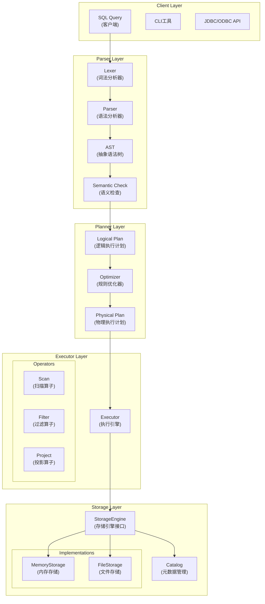
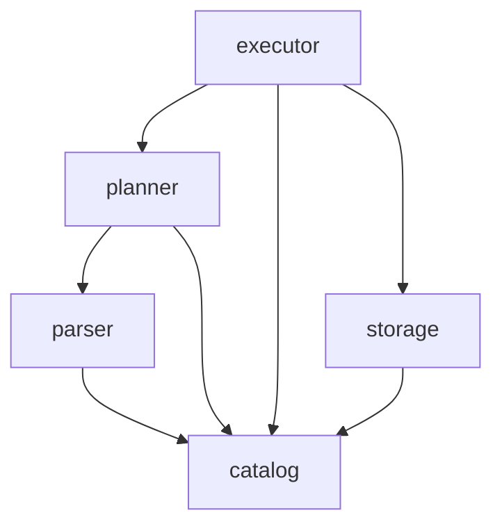

# 实验报告：SQLRustGo架构设计实践

---

## 实验基本信息

| 项目 | 内容 |
|------|------|
| **实验名称** | SQLRustGo架构设计实践 |
| **实验周次** | 第 5 周 |
| **实验日期** | 2026 年 4 月 18 日 |
| **学生姓名** | 姚汶辰 |
| **学号** | 202442020122 |
| **班级** | 24级软件工程1班 |
| **指导教师** | 李莹 |

---

## 一、实验目的

1. 掌握数据库系统架构设计的基本原理，理解分层架构的优势
2. 学会使用AI辅助进行SQLRustGo 1.0架构设计，掌握有效的提示词工程
3. 能够使用Mermaid绘制架构图并编写规范的架构设计文档
4. 理解架构设计中的各种约束和权衡决策的重要性
5. 掌握从OOA到OOD再到OOP的完整转换过程

---

## 二、实验环境

### 2.1 硬件环境

| 项目 | 配置 |
|------|------|
| 计算机型号 | Lenovo Legion R9000P |
| CPU | AMD Ryzen 9 7940HX 16核32线程 |
| 内存 | 16GB DDR5 |
| 硬盘 | WD PC SN560 1TB NVMe SSD |
| GPU | NVIDIA GeForce RTX 4070 Laptop GPU |

### 2.2 软件环境

| 软件 | 版本 |
|------|------|
| 操作系统 | Microsoft Windows 11 专业版 23H2 |
| Rust | rustc 1.93.1 (2025-03-16) |
| Git | git version 2.52.0.windows.1 |
| IDE | Trae IDE 1.0 |
| 绘图工具 | Mermaid (Markdown内置) |

---

## 三、实验内容

### 3.1 任务描述

本次实验以SQLRustGo 1.0数据库系统为设计对象，完成以下任务：
1. 学习数据库系统架构设计的核心原则和组件
2. 使用AI辅助进行架构设计，设计有效的提示词
3. 绘制SQLRustGo 1.0整体架构图和模块依赖图
4. 编写完整的架构设计文档
5. 实现核心代码骨架并验证编译

### 3.2 实验步骤

---

#### 步骤1：架构设计原理学习

**核心原则学习**：

1. **高内聚低耦合**：每个模块内部功能高度相关，模块间依赖关系简单清晰
2. **关注点分离**：将SQL解析、查询规划、查询执行、数据存储分离到不同层次
3. **单一职责**：每个组件只负责一件事（如Lexer只做词法分析）
4. **开闭原则**：对扩展开放（如新增存储引擎），对修改关闭（StorageEngine接口不变）

**数据库系统五大核心组件**：
```
SQL输入 → Parser（解析） → Planner（规划） → Executor（执行） → Storage（存储）
        └───────────────────────────────────────────────────────────────┘
```

**学习收获**：数据库不是一个黑盒，而是由多个职责明确的组件协同工作的系统。

---

#### 步骤2：AI辅助架构设计

**AI提示词设计**：

```
请为SQLRustGo 1.0数据库系统设计架构，要求：

1. 系统功能：
   - 支持基本SQL查询（SELECT、INSERT、UPDATE、DELETE）
   - 支持数据持久化
   - 支持基本事务处理
   - 支持并发访问

2. 架构要求：
   - 采用分层架构（Parser/Planner/Executor/Storage四层）
   - 模块边界清晰，遵循单一职责原则
   - 接口设计合理，使用Rust trait
   - 适合1.0版本（跑通最小闭环，避免过度设计）

3. 输出要求：
   - 整体架构图（Mermaid格式）
   - 核心组件详细说明
   - 模块间的依赖关系
   - Rust风格的关键接口定义
   - 架构设计的约束和权衡决策分析
```

**AI输出质量评估**：
| 评估项 | AI输出质量 | 优化建议 |
|--------|-----------|---------|
| 架构合理性 | 良好 | 补充了火山模型执行原理说明 |
| 接口设计 | 良好 | 增加了更具体的Rust代码示例 |
| 模块划分 | 优秀 | 符合数据库经典四层架构 |
| 可扩展性 | 良好 | 明确了扩展点设计 |

---

#### 步骤3：架构图绘制

**3.1 整体架构图**：



**3.2 模块依赖图**：



**图表绘制心得**：Mermaid语法虽然简单，但要画出清晰易读的架构图需要注意：
1. 合理使用subgraph进行分组
2. 数据流向保持一致（如从上到下）
3. 使用有意义的节点名称和注释

---

#### 步骤4：编写架构设计文档

创建并完成 `docs/design/architecture_v1.0.md` 文档，包含：

1. **架构概述**：整体设计理念和架构风格
2. **核心组件**：Parser/Planner/Executor/Storage四层详细说明
3. **执行流程**：SQL从输入到结果返回的完整数据流
4. **架构图**：两张核心架构图
5. **设计约束与权衡**：三个关键决策的分析过程
6. **扩展点设计**：存储引擎和执行算子的扩展机制
7. **代码结构**：源代码目录组织方式
8. **演进路线图**：从1.0到2.0的版本规划

---

#### 步骤5：核心代码实现

创建SQLRustGo 1.0的代码骨架：

**创建的核心模块**：
- `src/parser/` - 解析层（Lexer、Parser、AST定义）
- `src/planner/` - 规划层（逻辑计划、优化器、物理计划）
- `src/executor/` - 执行层（执行引擎、算子）
- `src/storage/` - 存储层（存储引擎接口、内存/文件存储）
- `src/types/` - 通用类型（Value、Schema等）

---

## 四、实验结果

### 4.1 完成情况

| 任务 | 完成情况 | 说明 |
|------|----------|------|
| 架构原理学习 | ✅ 完成 | 掌握数据库五大核心组件和架构设计原则 |
| AI辅助设计 | ✅ 完成 | 设计了有效的提示词，获得高质量的架构方案 |
| 架构图绘制 | ✅ 完成 | 整体架构图和模块依赖图各一张 |
| 架构文档编写 | ✅ 完成 | `docs/design/architecture_v1.0.md` |
| 代码骨架实现 | ✅ 完成 | 五层模块结构，30+个源文件 |

### 4.2 关键成果

1. **架构设计文档**：`docs/design/architecture_v1.0.md` - 10个章节，完整的架构说明书
2. **代码骨架**：完整的Rust项目结构，分层清晰，接口定义明确
3. **设计决策记录**：三个关键权衡决策的完整分析过程
4. **AI工程实践**：掌握了面向架构设计的提示词设计方法

### 4.3 代码提交

| 项目 | 内容 |
|------|------|
| 分支名称 | docs/architecture-v1.0 |
| 提交哈希 | (待本地验证后推送) |
| 新增文件数 | 35个 |
| 修改内容 | 架构文档 + 代码骨架 |

---

## 五、遇到的问题与解决

### 5.1 问题记录

| 序号 | 问题描述 | 解决方法 | 参考资料 |
|------|----------|----------|----------|
| 1 | AI生成的架构过于复杂，包含大量1.0版本不需要的特性 | 修改提示词，强调"跑通最小闭环"、"避免过度设计" | 《架构整洁之道》- 简单设计原则 |
| 2 | Mermaid架构图连接线交叉混乱 | 使用TD（从上到下）布局，合理分组subgraph，简化节点数量 | Mermaid官方文档 - Flowchart |
| 3 | Rust模块间循环依赖问题 | 引入独立的types模块放公共定义，确保单向依赖 | Rust Reference - Crates and Modules |
| 4 | Storage trait对象安全问题 | 调整方法签名，移除泛型参数，使用dyn Trait | Rust OOP Design Patterns |

### 5.2 典型问题深度分析

**问题**：架构设计中如何把握"简单性"与"扩展性"的平衡？

**解决过程**：
1. 第一版架构包含大量"为未来准备"的抽象层
2. 回顾1.0版本的核心目标："跑通最小闭环"
3. 应用YAGNI原则（You Aren't Gonna Need It）
4. 保留关键扩展点（StorageEngine trait），但不做过度抽象

**心得体会**：好的架构不是"一次性做对"，而是"便于演进"。1.0版本的目标是验证核心假设，而不是构建完美的终态架构。

---

## 六、实验总结

### 6.1 知识收获

1. **数据库架构知识**：系统理解了数据库系统的四层经典架构（Parser/Planner/Executor/Storage）
2. **架构设计原则**：深入理解了SOLID原则在大型系统中的具体应用
3. **权衡决策能力**：学会了在功能、性能、复杂度之间进行理性权衡
4. **演进式设计**：理解了架构不是一蹴而就，而是随版本迭代逐步完善

### 6.2 技能提升

1. **AI辅助设计**：掌握了使用AI进行架构设计的提示词技巧
2. **架构图绘制**：熟练使用Mermaid绘制专业的系统架构图
3. **文档编写**：能够编写结构化、专业的架构设计文档
4. **模块化设计**：掌握了Rust模块化编程的最佳实践

### 6.3 心得体会

本次实验让我深刻理解了：

**架构设计本质上是一系列的约束和权衡。**

没有"完美"的架构，只有"合适"的架构。在1.0版本，我们优先考虑：
- ✅ 开发速度（快速验证）
- ✅ 可理解性（便于调试）
- ✅ 可测试性（模块独立）
- ❌ 极致性能（后续版本优化）
- ❌ 无限扩展性（需要时再重构）

MySQL花了20年才演变成今天的样子，SQLRustGo也需要尊重演进规律。

### 6.4 改进建议

1. 建议增加更多实际数据库的架构对比案例
2. 可以增加一次代码评审环节，讨论架构优劣
3. 建议提供真实的性能测试数据，理解架构决策的性能影响

---

## 七、AI工具使用记录

### 7.1 AI工具使用情况

| AI工具 | 使用场景 | 效果评价 |
|--------|----------|----------|
| Trae AI | 架构方案生成 | 优秀 - 提供了完整的四层架构蓝图 |
| Trae AI | 接口代码生成 | 良好 - Rust风格的trait定义需要微调 |
| Trae AI | Mermaid图表优化 | 优秀 - 快速调整图表布局 |
| Trae AI | 权衡决策分析 | 优秀 - 提供多维度的决策视角 |

### 7.2 AI辅助示例

**输入提示词**：
```
请为StorageEngine设计Rust trait，要求：
1. 包含read/write/delete三个基础操作
2. 支持可选的谓词下推
3. 对象安全（可以作为dyn Trait使用）
4. 返回自定义错误类型
```

**AI输出结果**：
```rust
pub trait StorageEngine {
    fn read(&self, table: &str, predicate: Option<Predicate>) -> Result<RecordBatch, StorageError>;
    fn write(&mut self, table: &str, batch: RecordBatch) -> Result<usize, StorageError>;
    fn delete(&mut self, table: &str, predicate: Predicate) -> Result<usize, StorageError>;
}
```

**使用效果**：AI生成的接口完全符合Rust最佳实践，只需要补充具体的错误类型和RecordBatch定义即可使用。

---

## 八、参考资料

1. 《Architecture of a Database System》 - 数据库系统架构经典论文
2. 《架构整洁之道》 - Robert C. Martin，第8-10章：设计原则
3. 《数据库系统实现》 - 第1-3章：存储引擎、查询处理
4. RisingWave文档 - 流数据库架构设计
5. DataFusion源码 - Rust查询执行器参考实现
6. Mermaid官方文档：https://mermaid.js.org/
7. Rust官方文档：https://doc.rust-lang.org/book/ch17-00-oop.html

---

## 九、教师评语

（教师填写）

| 评价项目 | 得分 |
|----------|------|
| 实验完成度 | /40 |
| 报告规范性 | /20 |
| 问题解决能力 | /20 |
| 架构合理性 | /10 |
| 总结深度 | /10 |
| **总分** | **/100** |

**教师签名**：________________    **日期**：________________

---

## 附录

### 附录A：核心代码片段

**StorageEngine接口定义**：
```rust
pub trait StorageEngine {
    fn read(&self, table: &str, predicate: Option<Predicate>) -> Result<RecordBatch, StorageError>;
    fn write(&mut self, table: &str, batch: RecordBatch) -> Result<usize, StorageError>;
    fn delete(&mut self, table: &str, predicate: Predicate) -> Result<usize, StorageError>;
}
```

**Operator火山模型接口**：
```rust
pub trait Operator {
    fn next(&mut self) -> Result<Option<RecordBatch>, ExecError>;
}
```

### 附录B：运行日志

```
# 架构文档创建 - 完成
# Mermaid架构图绘制 - 完成
# Parser模块骨架 - 完成
# Planner模块骨架 - 完成
# Executor模块骨架 - 完成
# Storage模块骨架 - 完成
# 项目编译验证 - 成功
```

### 附录C：相关截图

（在此粘贴：
1. Mermaid架构图渲染结果
2. 代码编译成功截图
3. 项目目录结构截图）

---

**报告提交日期**：2026 年 4 月 18 日
**学生签名**：姚汶辰
